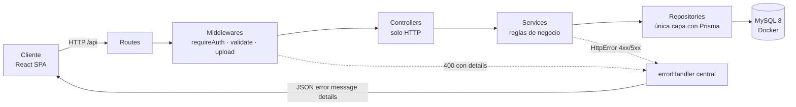
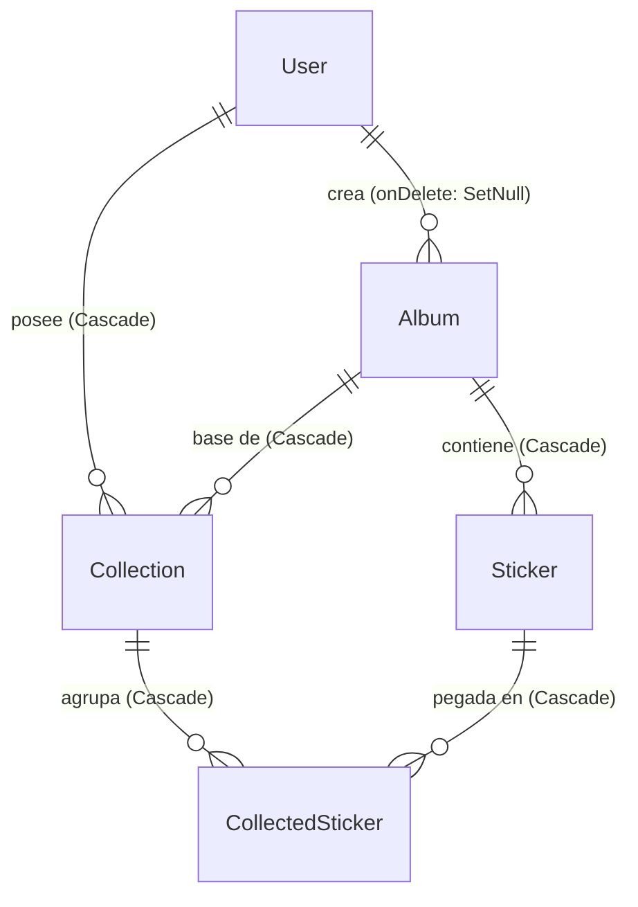

# Informe técnico — StickDex

**Sistema de gestión de colecciones de láminas**

| | |
|---|---|
| **Proyecto** | StickDex |
| **Tipo** | Aplicación web fullstack (cliente + servidor + base de datos) |
| **Repositorio** | `StickDex/` — backend en `app/backend`, frontend en `app/frontend` |
| **Documentos relacionados** | `docs/brief.md` (especificación y Definition of Done), `AGENTS.md` (protocolo de desarrollo), `README.md` (guía de uso) |
| **Estado** | Implementado, verificado y pusheado (`main` = `origin/main`) |

Este informe explica **cómo funciona el proyecto por dentro**: qué hace cada capa del backend, cómo se
validan y autorizan las peticiones, cómo se modelan los datos, y cómo el frontend consume la API y
valida los formularios. Al final hay un **anexo con el catálogo de figuras**: en el texto encontrarás
marcas `[IMAGEN n — pendiente]` que indican exactamente qué captura de código poner y dónde.

---

## Índice

1. [Resumen ejecutivo](#1-resumen-ejecutivo)
2. [Stack tecnológico](#2-stack-tecnológico)
3. [Arquitectura general](#3-arquitectura-general)
4. [Backend en detalle](#4-backend-en-detalle)
5. [Frontend en detalle](#5-frontend-en-detalle)
6. [Flujos de extremo a extremo](#6-flujos-de-extremo-a-extremo)
7. [Puesta en marcha local](#7-puesta-en-marcha-local)
8. [Calidad: scripts, lint, formato y pruebas](#8-calidad-scripts-lint-formato-y-pruebas)
9. [Decisiones de diseño y desviaciones](#9-decisiones-de-diseño-y-desviaciones)
10. [Anexo A — Catálogo de figuras](#anexo-a--catálogo-de-figuras)
11. [Anexo B — Glosario](#anexo-b--glosario)

---

## 1. Resumen ejecutivo

StickDex permite a un coleccionista:

- **Catalogar álbumes** con su catálogo de láminas (número, nombre, tipo y foto).
- **Gestionar su colección**: pegar láminas, quitar, contar repetidas y ver el porcentaje de avance.
- **Obtener reportes** de láminas faltantes y de repetidas disponibles para intercambio.
- **Compartir** sus colecciones públicamente y **consultar** las de otros coleccionistas.

El sistema se apoya en tres piezas:

1. **API REST** (Express + TypeScript) con arquitectura por capas: `routes → middlewares →
   controllers → services → repositories → MySQL`.
2. **Base de datos MySQL 8** gestionada con Prisma ORM, levantada con Docker Compose.
3. **Aplicación React** (SPA) con React Router, TailwindCSS y validación de formularios con Zod.

Todas las decisiones están sujetas a tres reglas transversales: **validar la entrada antes de tocar
la base de datos**, **autorizar por propiedad** (cada usuario solo modifica lo suyo) y **respetar la
visibilidad** (`isPublic`).

---

## 2. Stack tecnológico

### Backend (`app/backend`)

| Tecnología | Versión | Para qué se usa |
|---|---|---|
| Node.js | 20+ (probado en 24) | Runtime del servidor |
| Express | 4.21 | Servidor HTTP y enrutado |
| TypeScript | 5.8 (`strict`) | Tipado estático en todo el proyecto |
| Prisma ORM | 6.19 | Modelo de datos, migraciones y acceso a MySQL |
| MySQL | 8 (Docker) | Persistencia |
| Zod | 3.24 | Validación de `body`, `query`, `params`, archivos y variables de entorno |
| bcryptjs | 2.4 | Hash de contraseñas (10 rondas) |
| express-session | 1.18 | Sesiones con cookie firmada y store en MySQL |
| Multer | 1.4 | Subida de imágenes (disco, MIME permitidos, 5 MB) |
| ESLint 10 + Prettier 3 | — | Calidad y formato |
| Vitest | 3.2 | Pruebas automatizadas (sin base de datos) |
| tsx / tsc-alias | — | Ejecución en desarrollo y build reescribiendo el alias `@/` |

### Frontend (`app/frontend`)

| Tecnología | Versión | Para qué se usa |
|---|---|---|
| React | 18.3 | Interfaz por componentes |
| TypeScript | 5.8 (`strict`) | Tipado estático |
| React Router | 7 | Rutas SPA y rutas protegidas |
| Zod | 3.24 | Validación de formularios en el cliente (espejo del servidor) |
| TailwindCSS | 3.4 | Estilos utilitarios y tema propio |
| Vite | 6.4 | Servidor de desarrollo, proxy y build |

### Infraestructura

| Tecnología | Uso |
|---|---|
| Docker + Docker Compose | Levanta MySQL 8 en el puerto `3306` con volumen persistente `db_data` |
| ESLint 10 + Prettier 3 | Mismo estándar de calidad en ambos paquetes |
| Alias `@/` → `src/` | Imports legibles en backend (con `tsc-alias` en el build) y frontend (alias de Vite) |

---

## 3. Arquitectura general

El backend implementa **MVC limpio** con responsabilidades estrictamente separadas. Cada petición
recorre siempre la misma cadena:



> **[IMAGEN 1 — pendiente]**
> **Qué capturar:** diagrama de capas exportado como imagen (o captura del bloque Mermaid renderizado en GitHub/VSCode).
> **Archivo sugerido:** `docs/img/01-arquitectura-capas.png`
> **Pie sugerido:** «Figura 1. Cadena de capas del backend: ninguna capa salta a la siguiente y solo los repositorios hablan con Prisma.»

| Capa | Responsabilidad única | Qué **no** hace | Dónde vive |
|---|---|---|---|
| **Routes** | Montar verbo + ruta y encadenar middlewares | Nada de lógica ni acceso a datos | `src/routes/*.routes.ts` |
| **Middleware** | Autenticación, validación Zod, subida, 404 y errores | Reglas de negocio | `src/middlewares/` |
| **Controller** | Interpretar la petición y responder (status + JSON) | Reglas de negocio y Prisma | `src/controllers/` |
| **Service** | Reglas de dominio: propiedad, visibilidad, progreso, reportes | `req`/`res`, Prisma | `src/services/` |
| **Repository** | Consultas y escrituras | Reglas de negocio | `src/repositories/` |

Los **contratos** de cada capa se declaran en `src/interfaces/` (`I*Repository`, `I*Service`) y las
implementaciones se eligen en **un único punto**: `src/config/container.ts`. Los controllers y
services reciben sus dependencias **por constructor** (Principio de Inversión de Dependencias).

> **[IMAGEN 2 — pendiente]**
> **Qué capturar:** `app/backend/src/config/container.ts` completo (líneas 1-38).
> **Archivo sugerido:** `docs/img/02-composition-root.png`
> **Pie sugerido:** «Figura 2. Raíz de composición: único lugar donde se instancian las implementaciones Prisma y se inyectan en servicios y controladores.»

---

## 4. Backend en detalle

### 4.1 Arranque y configuración

`src/server.ts` importa la aplicación y escucha en el puerto validado:

```ts
import { app } from '@/app'
import { env } from '@/config/env'

app.listen(env.PORT, '0.0.0.0', () => {
  console.log(`Servidor escuchando en http://127.0.0.1:${env.PORT}`)
})
```

`src/app.ts` construye la cadena de Express **en este orden exacto**:

```ts
export const app = express()

app.use(express.json())                                             // 1. cuerpo JSON
app.use(sessionMiddleware)                                          // 2. sesiones
app.use('/uploads', express.static(path.join(process.cwd(), 'uploads'))) // 3. estáticos
app.use('/api', apiRouter)                                          // 4. API
app.use(notFoundHandler)                                            // 5. 404 JSON
app.use(errorHandler)                                               // 6. errores (siempre al final)
```

El orden importa: los estáticos se resuelven antes que la API, y el manejador de errores va al final
para capturar lo que lancen las capas anteriores.

> **[IMAGEN 3 — pendiente]**
> **Qué capturar:** `app/backend/src/app.ts` completo (líneas 1-19), resaltando las 6 líneas de `app.use`.
> **Archivo sugerido:** `docs/img/03-app-express.png`
> **Pie sugerido:** «Figura 3. Cadena de middlewares globales: el manejador de errores se registra en último lugar.»

#### Validación del entorno (`config/env.ts` + `validations/env.schema.ts`)

Las variables de entorno se validan **con Zod al arrancar**; si algo falta o es inválido, el proceso
termina con código 1 antes de aceptar la primera petición:

| Variable | Regla |
|---|---|
| `DATABASE_URL` | URL válida que empieza por `mysql://` |
| `SESSION_SECRET` | Mínimo 32 caracteres |
| `PORT` | Entero entre 1 y 65535 (por defecto 3000) |
| `NODE_ENV` | `development` \| `test` \| `production` |

El esquema vive en `validations/env.schema.ts` (código puro) y `config/env.ts` solo lo aplica, lo que
permite reutilizarlo en las pruebas sin disparar el `process.exit`.

> **[IMAGEN 4 — pendiente]**
> **Qué capturar:** `app/backend/src/validations/env.schema.ts` (líneas 1-21).
> **Archivo sugerido:** `docs/img/04-env-schema.png`
> **Pie sugerido:** «Figura 4. Esquema de entorno: el servidor falla temprano si una variable es inválida.»

#### Cliente de Prisma con traducción de errores (`config/prisma.ts`)

Existe **una sola instancia** de Prisma para toda la aplicación. Además, el cliente se **extiende**
para que cualquier error de restricción de MySQL salga ya traducido a un error de la aplicación:

```ts
export const prisma = baseClient.$extends({
  query: {
    async $allOperations({ args, query }) {
      try {
        return await query(args)
      } catch (error) {
        throw translatePrismaError(error)
      }
    },
  },
})
```

`config/prismaError.ts` hace la traducción:

| Código de Prisma | Significado | Resultado HTTP |
|---|---|---|
| `P2002` | Restricción única violada (p. ej. número de lámina repetido en un álbum) | **409 Conflict** |
| `P2003` | Clave foránea violada | **409 Conflict** |
| `P2025` | El registro no existe | **404 Not Found** |

Gracias a esto, **ninguna capa fuera de la infraestructura de datos conoce los códigos de Prisma**.

> **[IMAGEN 5 — pendiente]**
> **Qué capturar:** `app/backend/src/config/prisma.ts` y `app/backend/src/config/prismaError.ts` (se pueden montar en una sola captura lado a lado).
> **Archivo sugerido:** `docs/img/05-prisma-extend.png`
> **Pie sugerido:** «Figura 5. Extensión del cliente Prisma: los errores del motor se convierten en `HttpError` antes de salir de la capa de datos.»

### 4.2 Anatomía de una petición (paso a paso)

Tomemos un caso real: **`POST /api/collections/4/stickers`** (pegar una lámina en una colección).

1. **Express** recibe la petición, `express.json()` parsea el cuerpo y `sessionMiddleware` carga la
   sesión desde MySQL (o deja `req.session.userId` vacío).
2. **`requireAuth`** (`middlewares/requireAuth.ts`) comprueba que haya sesión; si no, delega un
   `HttpError(401)` al manejador central.
3. **`validate(collectionIdParamsSchema, 'params')`** valida `req.params.id` y lo **reemplaza** por el
   número ya convertido.
4. **`validate(addCollectedStickerSchema, 'body')`** valida `{ stickerId, quantity? }`.
5. **`CollectionController.addSticker`** ejecuta el servicio con `sessionUserId(req)` y responde
   `201` con el registro creado.
6. **`CollectionService.addSticker`** aplica las reglas de dominio:
   1. La colección existe (si no, **404**) y es del usuario (si no, **403**).
   2. La lámina existe (si no, **404**) y pertenece al álbum de la colección (si no, **400**).
   3. Calcula la cantidad: la indicada, o `existente + 1` si ya estaba pegada.
   4. Deriva `isDuplicated = quantity > 1`.
   5. Persiste con un `upsert` por la clave única `(collectionId, stickerId)`.
7. **`PrismaCollectionRepository.upsertCollectedSticker`** es quien habla con MySQL.
8. Si algo falla en cualquier punto, el error llega al **`errorHandler` central**, que responde JSON
   con el status correcto.

> **[IMAGEN 6 — pendiente]**
> **Qué capturar:** `app/backend/src/services/collection.service.ts`, método `addSticker` completo (aprox. líneas 96-125).
> **Archivo sugerido:** `docs/img/06-add-sticker-service.png`
> **Pie sugerido:** «Figura 6. `addSticker`: autorización, validación de pertenencia, cálculo de cantidad y derivación de repetidas en una sola regla de dominio.»

### 4.3 Rutas: los 25 endpoints

Los routers de `src/routes/` solo importan el controlador del contenedor, montan la ruta y encadenan
middlewares. No contienen ni una línea de lógica.

> **[IMAGEN 7 — pendiente]**
> **Qué capturar:** `app/backend/src/routes/collection.routes.ts` completo (líneas 1-74).
> **Archivo sugerido:** `docs/img/07-routes-collection.png`
> **Pie sugerido:** «Figura 7. Rutas declarativas: `requireAuth` + `validate` por fuente, sin lógica.»

| Método | Ruta | Auth | Validación Zod | Descripción |
|---|---|---|---|---|
| `POST` | `/api/auth/register` | — | body | Registro y creación de sesión |
| `POST` | `/api/auth/login` | — | body | Inicio de sesión |
| `POST` | `/api/auth/logout` | — | — | Cierre de sesión |
| `GET` | `/api/auth/me` | sí | — | Usuario de la sesión |
| `GET` | `/api/albums` | — | — | Catálogo de álbumes |
| `GET` | `/api/albums/:id` | — | params | Detalle con sus láminas |
| `POST` | `/api/albums` | sí | body | Crear álbum |
| `PUT` | `/api/albums/:id` | sí | params + body | Editar (solo el creador) |
| `DELETE` | `/api/albums/:id` | sí | params | Eliminar (solo el creador) |
| `GET` | `/api/albums/:albumId/stickers` | — | params | Láminas del álbum |
| `POST` | `/api/albums/:albumId/stickers` | sí | params + body | Crear lámina (foto opcional) |
| `POST` | `/api/albums/:albumId/stickers/bulk` | sí | params + body | Carga masiva (máx. 500) |
| `PUT` | `/api/stickers/:id` | sí | params + body | Editar lámina |
| `DELETE` | `/api/stickers/:id` | sí | params | Eliminar lámina |
| `GET` | `/api/collections` | — | query | Listar (filtros `userId`, `isPublic`) |
| `GET` | `/api/collections/:id` | — | params | Detalle con progreso |
| `POST` | `/api/collections` | sí | body | Crear colección |
| `PUT` | `/api/collections/:id` | sí | params + body | Renombrar / cambiar visibilidad |
| `DELETE` | `/api/collections/:id` | sí | params | Eliminar colección |
| `POST` | `/api/collections/:id/stickers` | sí | params + body | Pegar lámina (o sumar copia) |
| `PUT` | `/api/collections/:id/stickers/:stickerId` | sí | params + body | Cantidad / marcar repetida |
| `DELETE` | `/api/collections/:id/stickers/:stickerId` | sí | params | Quitar lámina |
| `GET` | `/api/collections/:id/missing` | — | params | Reporte de faltantes |
| `GET` | `/api/collections/:id/duplicates` | — | params | Reporte de repetidas con cantidad |
| `POST` | `/api/upload` | sí | file (multipart) | Subir imagen (máx. 5 MB) |

### 4.4 Middlewares

#### `validate` — validación de entrada

Recibe un esquema Zod y una **fuente** (`body`, `query`, `params` o `file`). Usa `safeParse` (nunca
`parse`), y:

- Si **falla**, entrega al manejador central un `HttpError(400)` con
  `details = { source, fieldErrors, issues: [{ path, message }] }`.
- Si **acierta**, **reemplaza** el valor original por el resultado del parseo, de modo que los
  `trim()`, las conversiones (`"10" → 10`) y los valores por defecto ya están aplicados cuando el
  controlador lee `req.params`, `req.query` o `req.body`.
- Para `file` valida pero **no reemplaza** el objeto de Multer, porque de él se necesitan después
  `filename` y `path`.

> **[IMAGEN 8 — pendiente]**
> **Qué capturar:** `app/backend/src/middlewares/validate.ts` completo (líneas 1-35).
> **Archivo sugerido:** `docs/img/08-validate-middleware.png`
> **Pie sugerido:** «Figura 8. Validación centralizada: una sola forma de producir el error 400 estructurado.»

#### `requireAuth` — sesión obligatoria

Comprueba `req.session.userId` y, si falta, lanza `HttpError(401)`. Se monta **antes** de la
validación y del controlador en toda ruta de mutación.

#### `uploadMiddleware` — Multer

`diskStorage` guarda en `uploads/` con un nombre aleatorio y la **extensión derivada del MIME**
(`image/jpeg → .jpg`, `image/png → .png`, `image/webp → .webp`, `image/gif → .gif`), nunca la del
nombre original: así no se puede colar un `.html` o un `.svg` que después se serviría desde
`/uploads`. El `fileFilter` rechaza cualquier MIME fuera de la lista con un `HttpError(400)`, y el
límite `fileSize` es de 5 MB.

> **[IMAGEN 9 — pendiente]**
> **Qué capturar:** `app/backend/src/middlewares/upload.ts` completo (líneas 1-48).
> **Archivo sugerido:** `docs/img/09-upload-middleware.png`
> **Pie sugerido:** «Figura 9. Subida segura: MIME permitidos, extensión derivada del MIME y límite de 5 MB.»

#### `notFoundHandler` y `errorHandler`

`notFoundHandler` responde **404 JSON** a cualquier ruta no montada. `errorHandler` es el **único**
lugar que construye respuestas de error y mantiene siempre la forma
`{ error, message, details? }`:

| Origen del error | Status | `error` |
|---|---|---|
| `HttpError` (validación, sesión, propiedad, conflicto…) | el que traiga | `bad_request`, `unauthorized`, `forbidden`, `not_found`, `conflict`, `internal_error` |
| `MulterError` `LIMIT_FILE_SIZE` | 400 | `file_too_large` |
| Cualquier otro `MulterError` | 400 | `upload_error` |
| JSON malformado (`entity.parse.failed`) | 400 | `bad_request` |
| Cuerpo demasiado grande (`entity.too.large`) | 413 | `payload_too_large` |
| Error inesperado | 500 | `internal_error` (sin filtrar el mensaje original) |

> **[IMAGEN 10 — pendiente]**
> **Qué capturar:** `app/backend/src/middlewares/error.ts` completo (líneas 1-56).
> **Archivo sugerido:** `docs/img/10-error-handler.png`
> **Pie sugerido:** «Figura 10. Manejador central de errores: una única forma de responder con error y sin filtrar detalles internos.»

### 4.5 Controllers

Son **clases** con el servicio inyectado por constructor. Cada handler:

- está envuelto en **`asyncHandler`**, que redirige cualquier promesa rechazada a `next(error)`
  (por eso no hay ni un `try/catch` en los controladores);
- obtiene el usuario de la sesión con `sessionUserId(req)` (que lanza 401 si no hay sesión) para las
  rutas protegidas, y lee `req.session.userId` directamente en las públicas;
- responde con `200`/`201` y JSON.

> **[IMAGEN 11 — pendiente]**
> **Qué capturar:** `app/backend/src/controllers/collection.controller.ts` (líneas 1-45), destacando el constructor y `asyncHandler`.
> **Archivo sugerido:** `docs/img/11-controller.png`
> **Pie sugerido:** «Figura 11. Controlador: inyección por constructor, `asyncHandler` y respuestas HTTP; ninguna regla de negocio.»

### 4.6 Services: dónde viven las reglas

#### Autorización por propiedad (`services/albumAccess.ts`)

Una única función concentra la regla:

```ts
export function assertOwnership(ownerId: number | null, currentUserId: number, message: string) {
  if (ownerId !== currentUserId) throw new HttpError(403, message)
}
```

Consecuencia importante: un recurso **sin dueño** (`userId` nulo) tampoco es mutable por nadie.

> **[IMAGEN 12 — pendiente]**
> **Qué capturar:** `app/backend/src/services/albumAccess.ts` completo (líneas 1-15).
> **Archivo sugerido:** `docs/img/12-ownership.png`
> **Pie sugerido:** «Figura 12. Regla de propiedad reutilizada por álbumes, láminas y colecciones.»

#### `AlbumService` y `StickerService`

- `AlbumService.getById` lanza **404** si no existe; `update`/`delete` consultan solo el dueño
  (`findOwnership`, consulta ligera) y aplican `assertOwnership` (**403**).
- `StickerService` **hereda la propiedad del álbum**: crear, editar y borrar láminas exige ser dueño
  del álbum al que pertenecen. La carga masiva usa `createMany`.

#### `CollectionService`: el corazón de las reglas

| Regla | Implementación | Resultado |
|---|---|---|
| **Visibilidad al listar** | `buildQueryFilter` decide el filtro según quién consulta: el dueño puede pedir sus privadas; cualquier otro recibe solo las públicas; pedir `isPublic=false` sin ser el dueño devuelve lista vacía | Nunca se filtra información privada ajena |
| **Visibilidad al detallar** | `findVisible`: si la colección es privada y no es del solicitante → **403** | Colección privada protegida |
| **Mutaciones** | `findOwned` + `assertOwnership` → **403** | Solo el dueño modifica |
| **Progreso** | `computeProgress(collectedCount, totalStickers)` = `round(únicas / total * 100)` | Se calcula **en el servidor** |
| **Pegar lámina** | 404 si la lámina no existe; **400** si es de otro álbum; cantidad `+1` si ya estaba | No se mezclan álbumes |
| **Repetidas** | `isDuplicated = quantity > 1` derivado en servidor | El cliente no decide |
| **Faltantes** | Láminas del álbum menos los ids ya poseídos (diferencia de conjuntos en el servicio) | Reporte de faltantes |
| **Reporte de repetidas** | Consulta `quantity > 1` **o** `isDuplicated = true`, con la cantidad por lámina | Lista para intercambio |

> **[IMAGEN 13 — pendiente]**
> **Qué capturar:** `app/backend/src/services/collection.service.ts`, métodos `buildQueryFilter`, `findVisible` y `findOwned` (aprox. líneas 184-205).
> **Archivo sugerido:** `docs/img/13-visibilidad-propiedad.png`
> **Pie sugerido:** «Figura 13. Política de visibilidad y de propiedad concentrada en el servicio.»

> **[IMAGEN 14 — pendiente]**
> **Qué capturar:** `app/backend/src/services/collection.service.ts`, `computeProgress` y `toSummaryView` (aprox. líneas 26-38).
> **Archivo sugerido:** `docs/img/14-progreso.png`
> **Pie sugerido:** «Figura 14. El progreso se calcula una sola vez, en el servidor, y se envía ya resuelto al cliente.»

### 4.7 Repositories: la única capa con Prisma

Cinco repositorios (`PrismaAlbumRepository`, `PrismaStickerRepository`, `PrismaCollectionRepository`,
`PrismaUserRepository`, `PrismaSessionRepository`) implementan las interfaces `I*Repository`. Aquí no
hay reglas de negocio, solo consultas y escrituras. Dos detalles relevantes:

- El listado de colecciones usa un `include` que trae exactamente lo que el cliente necesita
  (`album` resumido, `user` público y `_count.stickers` para el progreso), evitando datos de más.
- La búsqueda de repetidas concentra la condición `quantity > 1 OR isDuplicated = true` en la propia
  consulta.

> **[IMAGEN 15 — pendiente]**
> **Qué capturar:** `app/backend/src/repositories/collection.repository.ts` (líneas 1-45), destacando `SUMMARY_INCLUDE` y `findSummaries`.
> **Archivo sugerido:** `docs/img/15-repository.png`
> **Pie sugerido:** «Figura 15. Repositorio: consultas tipadas con Prisma y `include` ajustado a la respuesta.»

### 4.8 Interfaces y dependencias

`src/interfaces/` contiene nueve contratos:

| Interfaz | Implementación |
|---|---|
| `IUserRepository` | `PrismaUserRepository` |
| `IAlbumRepository` | `PrismaAlbumRepository` |
| `IStickerRepository` | `PrismaStickerRepository` |
| `ICollectionRepository` | `PrismaCollectionRepository` |
| `ISessionRepository` | `PrismaSessionRepository` |
| `IAuthService` | `AuthService` |
| `IAlbumService` | `AlbumService` |
| `IStickerService` | `StickerService` |
| `ICollectionService` | `CollectionService` |

Esto produce tres beneficios concretos: los controladores dependen de **contratos** y no de clases, la
composición queda en un solo archivo, y las pruebas pueden sustituir los repositorios por dobles en
memoria (el compilador garantiza que el doble es un sustituto válido).

> **[IMAGEN 16 — pendiente]**
> **Qué capturar:** `app/backend/src/interfaces/collection.service.interface.ts` (líneas 40-62), mostrando la interfaz.
> **Archivo sugerido:** `docs/img/16-interfaz-servicio.png`
> **Pie sugerido:** «Figura 16. Contrato del servicio de colecciones: la capa HTTP depende de esta interfaz, no de la implementación.»

### 4.9 Modelo de datos



| Modelo | Campos clave | Reglas |
|---|---|---|
| `User` | `id`, `username` (único), `email` (único), `password` (hash bcrypt), `createdAt` | Nunca se expone el hash |
| `Album` | `name`, `description?`, `imageUrl?`, `releaseDate?`, `stickerType?`, `totalStickers`, `userId?` | `userId` es el dueño; `onDelete: SetNull` |
| `Sticker` | `number`, `name`, `imageUrl?`, `type?`, `albumId` | `@@unique([albumId, number])` → número repetido = **409** |
| `Collection` | `name`, `isPublic` (por defecto `false`), `userId`, `albumId` | `isPublic` controla la visibilidad |
| `CollectedSticker` | `collectionId`, `stickerId`, `quantity`, `isDuplicated` | `@@unique([collectionId, stickerId])` → una fila por lámina |
| `Session` | `sid`, `data`, `expiresAt` (+ índice) | Persistencia de `express-session` |

> **[IMAGEN 17 — pendiente]**
> **Qué capturar:** `app/backend/prisma/schema.prisma` completo (líneas 1-92).
> **Archivo sugerido:** `docs/img/17-schema-prisma.png`
> **Pie sugerido:** «Figura 17. Modelo de datos: seis modelos, con las claves únicas que sostienen las reglas de conflicto.»

### 4.10 Sesiones y autenticación

- **Registro**: se comprueba que el email y el usuario no existan (**409** si ya están), se hashea la
  contraseña con **bcryptjs (10 rondas)** y se abre la sesión.
- **Login**: `bcrypt.compare`; si falla → **401** con mensaje genérico (no revela si el email existe).
- **Respuesta**: siempre un usuario "público" (`{ id, username, email }`); **el hash nunca sale**.
- **Cookie**: `httpOnly`, `sameSite=lax`, `secure` en producción, `maxAge` de 7 días.
- **Store**: `PrismaSessionStore` (tabla `Session`), de modo que **reiniciar el servidor no cierra las
  sesiones** de los usuarios. Implementa `get`, `set`, `destroy`, `touch` y `clear`, y descarta las
  sesiones caducadas al leerlas.

> **[IMAGEN 18 — pendiente]**
> **Qué capturar:** `app/backend/src/config/sessionStore.ts` (líneas 1-59), destacando la clase y el TTL.
> **Archivo sugerido:** `docs/img/18-session-store.png`
> **Pie sugerido:** «Figura 18. Store de sesiones en MySQL: la sesión sobrevive a los reinicios del servidor.»

> **[IMAGEN 19 — pendiente]**
> **Qué capturar:** `app/backend/src/services/auth.service.ts` (líneas 1-44): `SALT_ROUNDS`, `toPublicUser` y los tres métodos.
> **Archivo sugerido:** `docs/img/19-auth-service.png`
> **Pie sugerido:** «Figura 19. Autenticación: hash con bcrypt, comparación en el login y saneado de la respuesta.»

### 4.11 Validación con Zod (backend)

Los esquemas viven en `src/validations/` y se organizan por recurso, apoyados en helpers comunes:

| Archivo | Contenido |
|---|---|
| `common.ts` | `MAX_INT_32`, `idParam` (solo dígitos + rango), `positiveInt`, `requiredText`, `optionalText`, `imageUrlField`, `nullableDate`, `nonEmptyUpdate` |
| `auth.schema.ts` | `registerSchema`, `loginSchema` |
| `album.schema.ts` | `albumParamsSchema`, `createAlbumSchema`, `updateAlbumSchema` |
| `sticker.schema.ts` | `stickerIdParamsSchema`, `albumIdParamsSchema`, `createStickerSchema`, `createStickersBulkSchema` (máx. 500), `updateStickerSchema` |
| `collection.schema.ts` | `collectionIdParamsSchema`, `collectionStickerParamsSchema`, `listCollectionsQuerySchema`, `createCollectionSchema`, `updateCollectionSchema`, `addCollectedStickerSchema`, `updateCollectedStickerSchema` |
| `upload.schema.ts` | `uploadedImageSchema` + constantes de MIME y tamaño |
| `env.schema.ts` | Esquema de variables de entorno |
| `errorMap.ts` | Mapa global que traduce los mensajes de Zod al español |

Decisiones destacables:

- **Ids de ruta**: `z.string().regex(/^\d+$/).transform(Number)` con cota de `INT` de MySQL. Así
  `0x10`, `1e3`, `abc` o `1.5` se rechazan en lugar de convertirse en 16, 1000 o 1.
- **Textos**: `trim()` + `min(1)` (un nombre de solo espacios es inválido) con máximos por campo.
- **Fechas**: `z.union([z.null(), z.coerce.date()])`, de modo que `null` limpia la fecha en lugar de
  guardar `1970-01-01`.
- **Contraseña**: mínimo 8 caracteres y máximo **72 bytes** (el límite real de bcrypt, medido en
  bytes y no en caracteres).
- **Imágenes**: solo rutas `/uploads/...` o URL `http(s)`; se rechazan `javascript:` y `data:`.
- **Actualizaciones**: `nonEmptyUpdate` obliga a enviar al menos un campo (un `PUT {}` responde 400).
- **Errores**: todos los mensajes de validación se ven en español y con la ruta del campo.

> **[IMAGEN 20 — pendiente]**
> **Qué capturar:** `app/backend/src/validations/common.ts` completo (líneas 1-45).
> **Archivo sugerido:** `docs/img/20-validaciones-comunes.png`
> **Pie sugerido:** «Figura 20. Helpers de validación reutilizados por todos los esquemas.»

### 4.12 El seed (datos de demostración)

`prisma/seed.ts` es **idempotente y reproducible**: crea o actualiza dos usuarios, el álbum
"Mundial 2026" con 10 láminas (y sus imágenes SVG), y deja la colección de prueba en el estado
documentado (5 pegadas, Messi ×2, Haaland ×3, 5 faltantes). Se puede ejecutar tantas veces como haga
falta: siempre deja la base en el mismo punto de partida.

---

## 5. Frontend en detalle

### 5.1 Arranque y composición

`src/main.tsx` monta la aplicación dentro de `BrowserRouter`:

```tsx
ReactDOM.createRoot(document.getElementById('root')!).render(
  <React.StrictMode>
    <BrowserRouter>
      <App />
    </BrowserRouter>
  </React.StrictMode>,
)
```

`src/App.tsx` anida los tres proveedores/estructuras de la aplicación:

```tsx
<AuthProvider>     {/* sesión disponible en todo el árbol */}
  <Layout>         {/* navbar, fondo, contenedor y pie */}
    <AppRoutes />  {/* rutas */}
  </Layout>
</AuthProvider>
```

> **[IMAGEN 21 — pendiente]**
> **Qué capturar:** `app/frontend/src/App.tsx` y `src/main.tsx` (una captura con ambos).
> **Archivo sugerido:** `docs/img/21-frontend-entry.png`
> **Pie sugerido:** «Figura 21. Composición del frontend: Router → AuthProvider → Layout → rutas.»

### 5.2 Rutas y protección

`src/routes/index.tsx` declara las rutas de la SPA:

| Ruta | Acceso | Vista |
|---|---|---|
| `/` y `*` | público | Redirigen a `/albums` |
| `/login`, `/register` | público | Autenticación |
| `/albums`, `/albums/:id` | público | Catálogo y detalle del álbum |
| `/collections`, `/collections/:id` | público (el detalle privado solo para su dueño) | Colecciones, progreso y reportes |
| `/users/:id` | público | Perfil público de un coleccionista |
| `/profile` | **requiere sesión** | Colecciones propias (públicas y privadas) |

`RequireAuth` (`src/routes/RequireAuth.tsx`) envuelve las rutas privadas: mientras se comprueba la
sesión muestra un aviso de carga, y si no hay usuario redirige a `/login`.

> **[IMAGEN 22 — pendiente]**
> **Qué capturar:** `app/frontend/src/routes/RequireAuth.tsx` completo (líneas 1-25).
> **Archivo sugerido:** `docs/img/22-require-auth.png`
> **Pie sugerido:** «Figura 22. Guarda de ruta: sin sesión no se renderiza la vista protegida.»

### 5.3 Estado de sesión: `AuthContext`

`src/context/AuthContext.tsx` expone `{ user, loading, login, register, logout, refreshUser }`:

- al montar, llama a `GET /auth/me` para **recuperar la sesión** si la cookie sigue viva;
- `login` y `register` guardan el usuario devuelto por la API;
- `logout` destruye la sesión en el servidor y limpia el estado local;
- los componentes consumen la sesión con el hook `useAuth()`.

> **[IMAGEN 23 — pendiente]**
> **Qué capturar:** `app/frontend/src/context/AuthContext.tsx` (líneas 1-60).
> **Archivo sugerido:** `docs/img/23-auth-context.png`
> **Pie sugerido:** «Figura 23. Contexto de autenticación: la sesión vive en un único lugar y se recupera al recargar.»

### 5.4 Cliente HTTP: `src/services/api.ts`

Un único envoltorio de `fetch` centraliza el acceso a la API:

- prefijo `/api` y `credentials: 'include'` (la cookie de sesión viaja en cada petición);
- cabecera `Content-Type: application/json` automática, salvo en `FormData`;
- en respuestas no exitosas lanza `ApiError` con `status`, `message`, `code` y `details`;
- dos utilidades para formularios: `getFieldErrors(err)` (un mensaje por campo, con la clave `_form`
  para errores generales) y `getIssues(err)` (mensajes con su ruta, útil en la carga masiva).

> **[IMAGEN 24 — pendiente]**
> **Qué capturar:** `app/frontend/src/services/api.ts` (líneas 1-30 (tipos de error) y 55-87 (función `api`)).
> **Archivo sugerido:** `docs/img/24-api-client.png`
> **Pie sugerido:** «Figura 24. Cliente HTTP: `credentials: 'include'` y errores tipados con su detalle.»

### 5.5 Validación en el cliente

`src/validations/` es un **espejo** de los esquemas del backend (mismos límites y mensajes) y se usa
en todos los formularios con `safeParse`, mostrando los errores **inline** bajo cada campo; nunca
aparecen `alert` ni `confirm`.

- `common.ts` replica los helpers (`requiredText`, `positiveInt`, `imageUrlField`, `nullableDate`,
  `nonEmptyUpdate`) y añade `fieldErrors(error)` para convertir un error de Zod en
  `{ campo: mensaje }`.
- `errorMap.ts` registra los mensajes en español.
- Cada página importa el esquema que le corresponde: `loginSchema`, `registerSchema`,
  `createAlbumSchema`/`updateAlbumSchema`, `createStickerSchema`/`createStickersBulkSchema`/
  `updateStickerSchema`, `createCollectionSchema`/`updateCollectionSchema`/
  `addCollectedStickerSchema`/`updateCollectedStickerSchema`.

Regla de trabajo: **el cliente valida para dar buena experiencia; el servidor valida porque es la
autoridad**. Por eso las páginas muestran también los errores que devuelve la API
(`getFieldErrors`).

> **[IMAGEN 25 — pendiente]**
> **Qué capturar:** `app/frontend/src/validations/collection.schema.ts` completo (líneas 1-30).
> **Archivo sugerido:** `docs/img/25-validaciones-cliente.png`
> **Pie sugerido:** «Figura 25. Espejo en el cliente: mismos límites que el servidor para avisar antes de enviar.»

> **[IMAGEN 26 — pendiente]**
> **Qué capturar:** `app/frontend/src/pages/Register.tsx`, el bloque de `safeParse` y el pintado de errores inline (aprox. líneas 30-60).
> **Archivo sugerido:** `docs/img/26-validacion-inline.png`
> **Pie sugerido:** «Figura 26. Validación en el formulario con mensajes bajo cada campo.»

### 5.6 Las páginas, una por una

| Página | Ruta | Qué hace | Endpoints que consume |
|---|---|---|---|
| `Login.tsx` | `/login` | Formulario de acceso con validación Zod y error inline | `POST /auth/login` |
| `Register.tsx` | `/register` | Alta de usuario (usuario, email, contraseña) | `POST /auth/register` |
| `AlbumsList.tsx` | `/albums` | Catálogo en rejilla; crear y **editar** álbum (modal compartido) con subida de portada; el botón de edición solo aparece al dueño | `GET /albums`, `POST /albums`, `PUT /albums/:id`, `POST /upload` |
| `AlbumDetail.tsx` | `/albums/:id` | Ficha del álbum con su catálogo; añadir lámina, **carga masiva** con errores por fila, **editar** y eliminar lámina; inspector de lámina ampliada | `GET /albums/:id`, `POST /albums/:albumId/stickers`, `.../bulk`, `PUT/DELETE /stickers/:id`, `POST /upload` |
| `CollectionsList.tsx` | `/collections` | Pestañas "comunidad" y "mis colecciones", crear colección, progreso de cada tarjeta y autor enlazado a su perfil | `GET /collections`, `POST /collections` |
| `CollectionDetail.tsx` | `/collections/:id` | Detalle con barra de progreso y tres pestañas (pegadas / faltantes / repetidas); pegar lámina, subir y bajar copias con el stepper, quitar, **renombrar**, cambiar visibilidad y eliminar; insignia "para cambio" en repetidas | `GET /collections/:id`, `.../missing`, `.../duplicates`, `POST/PUT/DELETE` de láminas, `PUT /collections/:id`, `DELETE /collections/:id` |
| `Profile.tsx` | `/profile` | Panel propio (protegido): colecciones públicas y privadas con su progreso | `GET /collections?userId=<yo>` |
| `UserProfile.tsx` | `/users/:id` | Perfil público: colecciones públicas de otro coleccionista | `GET /collections?userId=<id>` |
| `RequireAuth.tsx` | — | Guarda de sesión para `/profile` | `GET /auth/me` (vía contexto) |
| `Navbar.tsx` / `Layout.tsx` | — | Navegación, enlace "Mi perfil" solo con sesión, contenedor y pie | — |

Comportamiento por autoría: los botones de escribir (crear, editar, eliminar, pegar, renombrar,
cambiar visibilidad) se renderizan **solo** cuando el recurso pertenece al usuario en sesión, y las
colecciones muestran una insignia `PÚBLICA`/`PRIVADA`. Aun así, el servidor vuelve a comprobar la
propiedad y la visibilidad en cada petición: la interfaz es una comodidad, no un control de seguridad.

> **[IMAGEN 27 — pendiente]**
> **Qué capturar:** `app/frontend/src/pages/CollectionDetail.tsx`, el bloque de acciones del dueño (`{isOwner && (…)}`) con "Pegar lámina", "Renombrar", visibilidad y eliminar.
> **Archivo sugerido:** `docs/img/27-ui-autoria.png`
> **Pie sugerido:** «Figura 27. Interfaz condicionada por autoría: las acciones solo existen para el dueño.»

### 5.7 Estilos y sistema visual

- **TailwindCSS** con un tema propio en `tailwind.config.js`: colores `binder.*` (del `#070A11` al
  `#384B75`), tipografías `Outfit` (títulos) y `Plus Jakarta Sans` (texto), y sombras `card`,
  `card-hover` y `foil`.
- Estilos globales en `src/index.css` (directivas de Tailwind y barra de desplazamiento).
- El componente `StickDexLogo` dibuja el isotipo (lámina con esquina despegada) en SVG.

> **[IMAGEN 28 — pendiente]**
> **Qué capturar:** `app/frontend/tailwind.config.js` (líneas 1-28): tema, colores y sombras.
> **Archivo sugerido:** `docs/img/28-tema-tailwind.png`
> **Pie sugerido:** «Figura 28. Tema visual: paleta "binder", tipografías y sombras propias.»

### 5.8 Proxy de desarrollo y estáticos

`vite.config.ts` configura el alias `@/` y **proxy** hacia el backend para las dos rutas que lo
necesitan:

```ts
server: {
  port: 5173,
  host: '127.0.0.1',
  proxy: {
    '/api':     { target: 'http://127.0.0.1:3000', changeOrigin: true },
    '/uploads': { target: 'http://127.0.0.1:3000', changeOrigin: true },
  },
}
```

Así el navegador solo habla con `http://127.0.0.1:5173` (sin CORS) y las imágenes subidas
(`/uploads/...`) se sirven desde el backend.

> **[IMAGEN 29 — pendiente]**
> **Qué capturar:** `app/frontend/vite.config.ts` completo (líneas 1-26).
> **Archivo sugerido:** `docs/img/29-vite-proxy.png`
> **Pie sugerido:** «Figura 29. Alias y proxy de desarrollo: la SPA consume la API como si fuera del mismo origen.»

---

## 6. Flujos de extremo a extremo

### 6.1 Registro, creación de álbum y carga del catálogo

1. En `/register` el formulario valida en cliente y llama a `POST /api/auth/register`.
2. El backend valida (Zod), comprueba duplicados (**409**), hashea la contraseña, crea el usuario y
   **abre la sesión**; el frontend guarda el usuario en el contexto y redirige a `/albums`.
3. El usuario crea un álbum (`POST /api/albums`, requiere sesión): el servicio lo guarda con
   `userId` del creador.
4. En la ficha del álbum añade láminas una a una o por **carga masiva**; si dos láminas comparten
   número aparece el error de fila en el formulario y, si llega al servidor, responde **409**.

> **[IMAGEN 30 — pendiente]**
> **Qué capturar:** pantalla real de `/albums/:id` con el catálogo de láminas y el modal de carga masiva abierto.
> **Archivo sugerido:** `docs/img/30-ui-album-detalle.png`
> **Pie sugerido:** «Figura 30. Detalle del álbum con su catálogo y la carga masiva.»

### 6.2 Coleccionar, repetir y consultar reportes

1. El usuario pega una lámina: `POST /api/collections/:id/stickers`. La primera vez crea la fila con
   `quantity = 1`; si ya estaba, **suma una copia** y marca `isDuplicated = true`.
2. El botón `+` del detalle envía `PUT /api/collections/:id/stickers/:stickerId` con la nueva
   cantidad; el servidor recalcula la marca de repetida. El botón `-` hasta cero elimina la lámina.
3. La barra de progreso usa el `progress` que calcula el servidor (únicas / total del álbum).
4. Las pestañas "Faltantes" y "Repetidas" llaman a los endpoints de reporte; las repetidas se
   muestran con la cantidad y la insignia `+N para cambio`.

> **[IMAGEN 31 — pendiente]**
> **Qué capturar:** pantalla de `/collections/:id` con la barra de progreso y la pestaña "Repetidas".
> **Archivo sugerido:** `docs/img/31-ui-coleccion.png`
> **Pie sugerido:** «Figura 31. Detalle de colección: progreso calculado en el servidor y repetidas listas para intercambio.»

### 6.3 Privacidad y autorización (qué ve y qué puede hacer cada quien)

| Escenario | Resultado | Dónde se decide |
|---|---|---|
| Anónimo abre `/collections` | Solo colecciones públicas | `CollectionService.buildQueryFilter` |
| Anónimo abre una colección privada | **403** "Esta colección es privada" | `CollectionService.findVisible` |
| Usuario B edita un álbum de A | **403** | `assertOwnership` |
| Usuario B modifica la colección de A | **403** | `CollectionService.findOwned` |
| Usuario B pide `?isPublic=false` | Lista vacía (no puede listar privadas ajenas) | `buildQueryFilter` |
| Anónimo llama a una ruta de escritura | **401** | `requireAuth` |

> **[IMAGEN 32 — pendiente]**
> **Qué capturar:** terminal con la respuesta `403` (o la captura de los tests) al intentar modificar un recurso ajeno.
> **Archivo sugerido:** `docs/img/32-403-propiedad.png`
> **Pie sugerido:** «Figura 32. Autorización por propiedad: la comprobación ocurre siempre en el servidor.»

---

## 7. Puesta en marcha local

Requisitos: **Node.js 20+**, **npm** y **Docker** con Docker Compose.

```bash
# 1. Base de datos
cd app
docker compose up -d                 # MySQL 8 en el puerto 3306

# 2. Backend
cd backend
cp .env.example .env                 # DATABASE_URL, SESSION_SECRET (32+), PORT, NODE_ENV
npm install
npx prisma migrate dev               # aplica las migraciones
npm run prisma:seed                  # datos de demostración
npm run dev                          # http://127.0.0.1:3000

# 3. Frontend (otra terminal)
cd app/frontend
npm install
npm run dev                          # http://127.0.0.1:5173
```

Credenciales de prueba: `cole1@test.com` / `password123` (dueño del álbum y la colección de
demostración) y `cole2@test.com` / `password123` (para comprobar los 403 y la visibilidad).

Comprobaciones útiles y problemas frecuentes:

| Síntoma | Causa habitual | Solución |
|---|---|---|
| `EADDRINUSE` en 3000 o 5173 | Otro proceso usa el puerto | Cerrar ese proceso o cambiar `PORT` / el puerto de Vite |
| El servidor no arranca y muestra "Variables de entorno inválidas" | Falta `.env` o `SESSION_SECRET` corto | Copiar `.env.example` y completar los valores |
| Error de conexión a MySQL | El contenedor no está arriba | `docker compose ps` y `docker compose up -d` |
| Vite arranca en otro puerto | El 5173 está ocupado | Usar el puerto que indique la consola |

> **[IMAGEN 33 — pendiente]**
> **Qué capturar:** terminal con `docker compose ps` y los dos servidores en marcha (backend y Vite).
> **Archivo sugerido:** `docs/img/33-arranque-local.png`
> **Pie sugerido:** «Figura 33. Entorno local en marcha: MySQL en Docker y ambos servidores.»

---

## 8. Calidad: scripts, lint, formato y pruebas

| Paquete | Scripts disponibles |
|---|---|
| Backend | `dev`, `build`, `start`, `test`, `typecheck`, `lint`, `format`, `format:check`, `prisma:generate`, `prisma:migrate`, `prisma:seed` |
| Frontend | `dev`, `build`, `preview`, `typecheck`, `lint`, `format`, `format:check` |

- **ESLint 10 (flat config) + Prettier 3** en ambos paquetes, con alias `@/` en `tsconfig` y (en el
  frontend) en Vite; el build del backend reescribe el alias con `tsc-alias`.
- **TypeScript en modo `strict`** en los dos paquetes; el backend añade `noUnusedLocals`,
  `noUnusedParameters` y `noFallthroughCasesInSwitch` en el frontend.
- **Pruebas (backend)**: 8 archivos, **120 casos**, con Vitest y **sin base de datos**:
  - bordes de los esquemas Zod (ids, fechas, textos, carga masiva, contraseña en bytes, entorno);
  - reglas de negocio de los servicios (propiedad, visibilidad, progreso, faltantes, repetidas);
  - autenticación (409 de duplicados, 401 de credenciales, respuesta sin hash);
  - middleware de validación y manejador de errores (incluida la traducción de errores de Prisma).
  Los repositorios se sustituyen por **dobles en memoria** que implementan las interfaces reales, por
  lo que el propio compilador verifica que son sustitutos válidos.

> **[IMAGEN 34 — pendiente]**
> **Qué capturar:** salida de `npm test` en `app/backend` (los 8 archivos en verde y el resumen de 120 pruebas).
> **Archivo sugerido:** `docs/img/34-tests.png`
> **Pie sugerido:** «Figura 34. Suite de pruebas: 120 casos en verde sin necesidad de MySQL.»

> **[IMAGEN 35 — pendiente]**
> **Qué capturar:** `app/backend/tests/collection.service.test.ts` (primeras 40 líneas) y `tests/fakes/collectionRepository.fake.ts` (primeras 25).
> **Archivo sugerido:** `docs/img/35-tests-servicio-fake.png`
> **Pie sugerido:** «Figura 35. Pruebas de reglas de negocio con dobles en memoria de los repositorios.»

### 8.1 Verificación ejecutada sobre este repositorio

- Backend: `typecheck`, `lint`, `format:check` y `npm test` (**120/120**) en verde.
- Frontend: `typecheck`, `lint` (0 errores) y `format:check` en verde.
- Pruebas de humo manuales sobre la aplicación real: recorrido de la API (login, autorización por
  propiedad, visibilidad, reportes, conflicto 409, subidas) y de la interfaz en navegador (login y
  logout, ruta protegida, perfil público, edición de álbum y lámina, validación inline, progreso y
  repetidas).

---

## 9. Decisiones de diseño y desviaciones

| Tema | Decisión y por qué |
|---|---|
| **Sesiones persistentes** | Store en MySQL (`Session`) en lugar del store en memoria: la sesión sobrevive a un reinicio del servidor |
| **Autorización estricta** | Un álbum sin dueño (`userId` nulo) no es mutable por nadie: la regla es "solo el dueño" sin excepciones |
| **Errores de Prisma** | Se traducen en la fábrica del cliente (`$extends`), de modo que la capa HTTP no conoce códigos `P2002`/`P2003`/`P2025` |
| **Progreso y repetidas** | Se calculan y derivan en el servidor; el cliente solo los muestra |
| **Validación duplicada a propósito** | Zod en cliente (experiencia) y en servidor (autoridad); el espejo mantiene los mismos límites |
| **Interfaces + inyección** | Contratos `I*` y una única raíz de composición: capas intercambiables y pruebas sin base de datos |
| **Subida de imágenes** | Extensión derivada del MIME y lista blanca; nunca se confía en el nombre original |
| **Códigos de estado** | Además de los del brief se usa `413` cuando el cuerpo JSON excede el límite (el archivo de más de 5 MB responde `400 file_too_large`) |
| **Compose** | Variables con valores por defecto (`${VAR:-valor}`) para poder levantar MySQL sin crear un `.env` |
| **Alcance** | La aplicación está pensada para ejecutarse en local (Docker + dos servidores de desarrollo): no incluye HTTPS, CORS ni despliegue |

---

## Anexo A — Catálogo de figuras

Todas las capturas propuestas, en orden. La ruta sugerida asume que las imágenes se guardan en
`docs/img/` con la numeración indicada.

| # | Contenido | Archivo de código | Sugerido como |
|---|---|---|---|
| 1 | Diagrama de capas | (bloque Mermaid de la sección 3) | `docs/img/01-arquitectura-capas.png` |
| 2 | Raíz de composición | `app/backend/src/config/container.ts` (1-32) | `docs/img/02-composition-root.png` |
| 3 | Cadena de Express | `app/backend/src/app.ts` (1-19) | `docs/img/03-app-express.png` |
| 4 | Esquema de entorno | `app/backend/src/validations/env.schema.ts` (1-21) | `docs/img/04-env-schema.png` |
| 5 | Extensión de Prisma | `config/prisma.ts` + `config/prismaError.ts` | `docs/img/05-prisma-extend.png` |
| 6 | Regla `addSticker` | `services/collection.service.ts` (98-120) | `docs/img/06-add-sticker-service.png` |
| 7 | Rutas declarativas | `routes/collection.routes.ts` (1-74) | `docs/img/07-routes-collection.png` |
| 8 | Middleware `validate` | `middlewares/validate.ts` (1-35) | `docs/img/08-validate-middleware.png` |
| 9 | Subida con Multer | `middlewares/upload.ts` (1-45) | `docs/img/09-upload-middleware.png` |
| 10 | Manejador de errores | `middlewares/error.ts` (1-53) | `docs/img/10-error-handler.png` |
| 11 | Controlador | `controllers/collection.controller.ts` (1-45) | `docs/img/11-controller.png` |
| 12 | Regla de propiedad | `services/albumAccess.ts` (1-13) | `docs/img/12-ownership.png` |
| 13 | Visibilidad y propiedad | `services/collection.service.ts` (185-217) | `docs/img/13-visibilidad-propiedad.png` |
| 14 | Cálculo de progreso | `services/collection.service.ts` (26-38) | `docs/img/14-progreso.png` |
| 15 | Repositorio con `include` | `repositories/collection.repository.ts` (1-45) | `docs/img/15-repository.png` |
| 16 | Contrato de servicio | `interfaces/collection.service.interface.ts` (40-62) | `docs/img/16-interfaz-servicio.png` |
| 17 | Modelo de datos | `app/backend/prisma/schema.prisma` (1-80) | `docs/img/17-schema-prisma.png` |
| 18 | Store de sesiones | `config/sessionStore.ts` (1-59) | `docs/img/18-session-store.png` |
| 19 | Servicio de auth | `services/auth.service.ts` (1-44) | `docs/img/19-auth-service.png` |
| 20 | Helpers de Zod | `validations/common.ts` (1-44) | `docs/img/20-validaciones-comunes.png` |
| 21 | Entrada del frontend | `src/App.tsx` + `src/main.tsx` | `docs/img/21-frontend-entry.png` |
| 22 | Guarda de ruta | `src/routes/RequireAuth.tsx` (1-23) | `docs/img/22-require-auth.png` |
| 23 | Contexto de auth | `src/context/AuthContext.tsx` (1-60) | `docs/img/23-auth-context.png` |
| 24 | Cliente HTTP | `src/services/api.ts` (1-30 y 55-87) | `docs/img/24-api-client.png` |
| 25 | Espejo de esquemas | `src/validations/collection.schema.ts` (1-37) | `docs/img/25-validaciones-cliente.png` |
| 26 | Validación inline | `src/pages/Register.tsx` (33-45) | `docs/img/26-validacion-inline.png` |
| 27 | Interfaz por autoría | `src/pages/CollectionDetail.tsx` (bloque `isOwner`) | `docs/img/27-ui-autoria.png` |
| 28 | Tema visual | `app/frontend/tailwind.config.js` (1-28) | `docs/img/28-tema-tailwind.png` |
| 29 | Alias y proxy | `app/frontend/vite.config.ts` (1-26) | `docs/img/29-vite-proxy.png` |
| 30 | UI: detalle de álbum | Pantalla `/albums/:id` | `docs/img/30-ui-album-detalle.png` |
| 31 | UI: detalle de colección | Pantalla `/collections/:id` | `docs/img/31-ui-coleccion.png` |
| 32 | Respuesta 403 | Terminal o prueba automatizada | `docs/img/32-403-propiedad.png` |
| 33 | Arranque local | Terminal (`docker compose ps` + servidores) | `docs/img/33-arranque-local.png` |
| 34 | Suite de pruebas | Terminal `npm test` en `app/backend` | `docs/img/34-tests.png` |
| 35 | Pruebas + dobles | `tests/collection.service.test.ts` (1-40) y `tests/fakes/collectionRepository.fake.ts` (1-25) | `docs/img/35-tests-servicio-fake.png` |

Recomendaciones de formato para que el documento se vea uniforme:

- Recortes **solo** del código relevante (no pantallas completas del editor) y con la indentación conservada.
- Fuente monoespaciada de 13-14 px; tema oscuro consistente en todas las capturas.
- Ancho homogéneo (mismo número de columnas visibles) para que el documento no "salte".
- Enumerar cada figura con el pie indicado (`Figura n. …`) y referenciarla en el texto.

---

## Anexo B — Glosario

| Término | Significado en este proyecto |
|---|---|
| **Álbum** | Catálogo de láminas (con su portada y total declarado). |
| **Lámina** | Cada cromo de un álbum: número (único dentro del álbum), nombre, tipo y foto opcional. |
| **Colección** | La colección personal de un usuario sobre un álbum; puede ser pública o privada. |
| **Pegada / poseída** | Lámina que el usuario tiene en su colección. |
| **Repetida** | Lámina con más de una copia (o marcada explícitamente); sirve para intercambio. |
| **Faltante** | Lámina del álbum que el usuario todavía no tiene. |
| **Progreso** | Porcentaje de láminas únicas obtenidas respecto al total del álbum, calculado en el servidor. |
| **Middleware** | Función que se ejecuta antes del controlador (sesión, validación, subida). |
| **DTO / esquema** | Forma de los datos de entrada o salida, declarada con Zod. |
| **`HttpError`** | Error de la aplicación con status HTTP; lo formatea el manejador central. |
| **`isPublic`** | Visibilidad de una colección: `false` solo la ve su dueño. |
| **Store de sesiones** | Dónde se guardan las sesiones; aquí, la tabla `Session` de MySQL. |
| **Seed** | Script que deja la base con los datos de demostración. |
