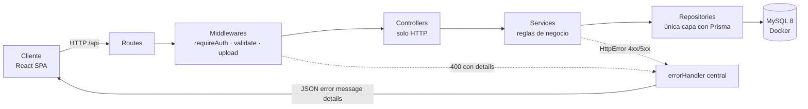
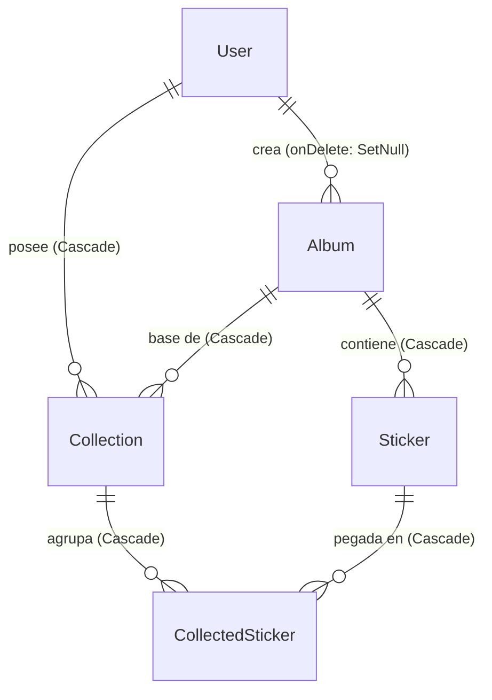

# Informe técnico — StickDex

**Sistema de gestión de colecciones de láminas**

| | |
|---|---|
| **Proyecto** | StickDex |
| **Tipo** | Aplicación web fullstack (cliente + servidor + base de datos) |
| **Repositorio** | `StickDex/` — backend en `app/backend`, frontend en `app/frontend` |
| **Documentos relacionados** | `docs/brief.md` (especificación y Definition of Done), `AGENTS.md` (protocolo de desarrollo), `README.md` (guía de uso) |
| **Estado** | Implementado y verificado: typecheck, lint, formato y 120 pruebas automatizadas en verde, y el stack completo levantado con Docker Compose con los tres servicios en `(healthy)` |

Este informe explica **cómo funciona el proyecto por dentro**: qué hace cada capa del backend, cómo se
validan y autorizan las peticiones, cómo se modelan los datos, y cómo el frontend consume la API y
valida los formularios. Cada explicación va acompañada del **código real** del proyecto, copiado de
los archivos tal como están en el repositorio.

---

## Índice

1. [Resumen ejecutivo](#1-resumen-ejecutivo)
2. [Stack tecnológico](#2-stack-tecnológico)
3. [Arquitectura general](#3-arquitectura-general)
4. [Backend en detalle](#4-backend-en-detalle)
5. [Frontend en detalle](#5-frontend-en-detalle)
6. [Flujos de extremo a extremo](#6-flujos-de-extremo-a-extremo)
7. [Puesta en marcha local](#7-puesta-en-marcha-local)
8. [Calidad: scripts, lint, formato y pruebas](#8-calidad-scripts-lint-formato-y-pruebas)
9. [Decisiones de diseño y desviaciones](#9-decisiones-de-diseño-y-desviaciones)
10. [Anexo A — Glosario](#anexo-a--glosario)

---

## 1. Resumen ejecutivo

StickDex permite a un coleccionista:

- **Catalogar álbumes** con su catálogo de láminas (número, nombre, tipo y foto).
- **Gestionar su colección**: pegar láminas, quitar, contar repetidas y ver el porcentaje de avance.
- **Obtener reportes** de láminas faltantes y de repetidas disponibles para intercambio.
- **Compartir** sus colecciones públicamente y **consultar** las de otros coleccionistas.

El sistema se apoya en tres piezas:

1. **API REST** (Express + TypeScript) con arquitectura por capas: `routes → middlewares →
   controllers → services → repositories → MySQL`.
2. **Base de datos MySQL 8** gestionada con Prisma ORM, levantada con Docker Compose.
3. **Aplicación React** (SPA) con React Router, TailwindCSS y validación de formularios con Zod.

Todas las decisiones están sujetas a tres reglas transversales: **validar la entrada antes de tocar
la base de datos**, **autorizar por propiedad** (cada usuario solo modifica lo suyo) y **respetar la
visibilidad** (`isPublic`).

---

## 2. Stack tecnológico

### Backend (`app/backend`)

| Tecnología | Versión | Para qué se usa |
|---|---|---|
| Node.js | 20+ (probado en 24) | Runtime del servidor |
| Express | 4.21 | Servidor HTTP y enrutado |
| TypeScript | 5.8 (`strict`) | Tipado estático en todo el proyecto |
| Prisma ORM | 6.19 | Modelo de datos, migraciones y acceso a MySQL |
| MySQL | 8 (Docker) | Persistencia |
| Zod | 3.24 | Validación de `body`, `query`, `params`, archivos y variables de entorno |
| bcryptjs | 2.4 | Hash de contraseñas (10 rondas) |
| express-session | 1.18 | Sesiones con cookie firmada y store en MySQL |
| Multer | 1.4 | Subida de imágenes (disco, MIME permitidos, 5 MB) |
| ESLint 10 + Prettier 3 | — | Calidad y formato |
| Vitest | 3.2 | Pruebas automatizadas (sin base de datos) |
| tsx / tsc-alias | — | Ejecución en desarrollo y build reescribiendo el alias `@/` |

### Frontend (`app/frontend`)

| Tecnología | Versión | Para qué se usa |
|---|---|---|
| React | 18.3 | Interfaz por componentes |
| TypeScript | 5.8 (`strict`) | Tipado estático |
| React Router | 7 | Rutas SPA y rutas protegidas |
| Zod | 3.24 | Validación de formularios en el cliente (espejo del servidor) |
| TailwindCSS | 3.4 | Estilos utilitarios y tema propio |
| Vite | 6.4 | Servidor de desarrollo, proxy y build |

### Infraestructura

| Tecnología | Uso |
|---|---|
| Docker + Docker Compose | Levanta el stack completo (MySQL 8 + backend + frontend) con health checks y un volumen persistente para la base |
| ESLint 10 + Prettier 3 | Mismo estándar de calidad en ambos paquetes |
| Alias `@/` → `src/` | Imports legibles en backend (con `tsc-alias` en el build) y frontend (alias de Vite) |

---

## 3. Arquitectura general

El backend implementa **MVC limpio** con responsabilidades estrictamente separadas. Cada petición
recorre siempre la misma cadena:




| Capa | Responsabilidad única | Qué **no** hace | Dónde vive |
|---|---|---|---|
| **Routes** | Montar verbo + ruta y encadenar middlewares | Nada de lógica ni acceso a datos | `src/routes/*.routes.ts` |
| **Middleware** | Autenticación, validación Zod, subida, 404 y errores | Reglas de negocio | `src/middlewares/` |
| **Controller** | Interpretar la petición y responder (status + JSON) | Reglas de negocio y Prisma | `src/controllers/` |
| **Service** | Reglas de dominio: propiedad, visibilidad, progreso, reportes | `req`/`res`, Prisma | `src/services/` |
| **Repository** | Consultas y escrituras | Reglas de negocio | `src/repositories/` |

Los **contratos** de cada capa se declaran en `src/interfaces/` (`I*Repository`, `I*Service`) y las
implementaciones se eligen en **un único punto**: `src/config/container.ts`. Los controllers y
services reciben sus dependencias **por constructor** (Principio de Inversión de Dependencias).

**`app/backend/src/config/container.ts` (líneas 1-32)**

```ts
import { PrismaAlbumRepository } from '@/repositories/album.repository'
import { PrismaCollectionRepository } from '@/repositories/collection.repository'
import { PrismaSessionRepository } from '@/repositories/session.repository'
import { PrismaStickerRepository } from '@/repositories/sticker.repository'
import { PrismaUserRepository } from '@/repositories/user.repository'
import { AlbumService } from '@/services/album.service'
import { AuthService } from '@/services/auth.service'
import { CollectionService } from '@/services/collection.service'
import { StickerService } from '@/services/sticker.service'
import { AlbumController } from '@/controllers/album.controller'
import { AuthController } from '@/controllers/auth.controller'
import { CollectionController } from '@/controllers/collection.controller'
import { StickerController } from '@/controllers/sticker.controller'
import { UploadController } from '@/controllers/upload.controller'
import { PrismaSessionStore } from '@/config/sessionStore'

// Raíz de composición: único lugar donde se eligen las implementaciones
// concretas y se inyectan por constructor (Dependency Inversion).
const users = new PrismaUserRepository()
const albums = new PrismaAlbumRepository()
const stickers = new PrismaStickerRepository()
const collections = new PrismaCollectionRepository()

export const sessionStore = new PrismaSessionStore(new PrismaSessionRepository())

export const authController = new AuthController(new AuthService(users))
export const albumController = new AlbumController(new AlbumService(albums))
export const stickerController = new StickerController(new StickerService(stickers, albums))
export const collectionController = new CollectionController(
  new CollectionService(collections, stickers, albums, users),
)
export const uploadController = new UploadController()
```


---

## 4. Backend en detalle

### 4.1 Arranque y configuración

`src/server.ts` importa la aplicación y escucha en el puerto validado:

```ts
import { app } from '@/app'
import { env } from '@/config/env'

app.listen(env.PORT, '0.0.0.0', () => {
  console.log(`Servidor escuchando en http://127.0.0.1:${env.PORT}`)
})
```

`src/app.ts` construye la cadena de Express **en este orden exacto**:

```ts
export const app = express()

app.use(express.json())                                             // 1. cuerpo JSON
app.use(sessionMiddleware)                                          // 2. sesiones
app.use('/uploads', express.static(path.join(process.cwd(), 'uploads'))) // 3. estáticos
app.use('/api', apiRouter)                                          // 4. API
app.use(notFoundHandler)                                            // 5. 404 JSON
app.use(errorHandler)                                               // 6. errores (siempre al final)
```

El orden importa: los estáticos se resuelven antes que la API, y el manejador de errores va al final
para capturar lo que lancen las capas anteriores.

**`app/backend/src/app.ts` (líneas 1-19)**

```ts
import path from 'path'
import express from 'express'
import { sessionMiddleware } from '@/config/session'
import { errorHandler } from '@/middlewares/error'
import { notFoundHandler } from '@/middlewares/notFound'
import { apiRouter } from '@/routes'

export const app = express()

app.use(express.json())
app.use(sessionMiddleware)

// Servir archivos estáticos subidos
app.use('/uploads', express.static(path.join(process.cwd(), 'uploads')))

app.use('/api', apiRouter)

app.use(notFoundHandler)
app.use(errorHandler)
```


#### Validación del entorno (`config/env.ts` + `validations/env.schema.ts`)

Las variables de entorno se validan **con Zod al arrancar**; si algo falta o es inválido, el proceso
termina con código 1 antes de aceptar la primera petición:

| Variable | Regla |
|---|---|
| `DATABASE_URL` | URL válida que empieza por `mysql://` |
| `SESSION_SECRET` | Mínimo 32 caracteres |
| `PORT` | Entero entre 1 y 65535 (por defecto 3000) |
| `NODE_ENV` | `development` \| `test` \| `production` |

El esquema vive en `validations/env.schema.ts` (código puro) y `config/env.ts` solo lo aplica, lo que
permite reutilizarlo en las pruebas sin disparar el `process.exit`.

**`app/backend/src/validations/env.schema.ts` (líneas 1-21)**

```ts
import { z } from 'zod'

/** Esquema de variables de entorno; se valida al arrancar el servidor. */
export const envSchema = z.object({
  DATABASE_URL: z
    .string({ required_error: 'DATABASE_URL es obligatoria' })
    .url({ message: 'DATABASE_URL debe ser una URL válida' })
    .startsWith('mysql://', { message: 'DATABASE_URL debe apuntar a MySQL (mysql://...)' }),
  SESSION_SECRET: z
    .string({ required_error: 'SESSION_SECRET es obligatoria' })
    .min(32, { message: 'SESSION_SECRET debe tener al menos 32 caracteres' }),
  PORT: z.coerce
    .number({ invalid_type_error: 'PORT debe ser numérico' })
    .int({ message: 'PORT debe ser un puerto entero' })
    .min(1, { message: 'PORT debe estar entre 1 y 65535' })
    .max(65535, { message: 'PORT debe estar entre 1 y 65535' })
    .default(3000),
  NODE_ENV: z.enum(['development', 'test', 'production']).default('development'),
})

export type Env = z.infer<typeof envSchema>
```


#### Cliente de Prisma con traducción de errores (`config/prisma.ts`)

Existe **una sola instancia** de Prisma para toda la aplicación. Además, el cliente se **extiende**
para que cualquier error de restricción de MySQL salga ya traducido a un error de la aplicación:

```ts
export const prisma = baseClient.$extends({
  query: {
    async $allOperations({ args, query }) {
      try {
        return await query(args)
      } catch (error) {
        throw translatePrismaError(error)
      }
    },
  },
})
```

`config/prismaError.ts` hace la traducción:

| Código de Prisma | Significado | Resultado HTTP |
|---|---|---|
| `P2002` | Restricción única violada (p. ej. número de lámina repetido en un álbum) | **409 Conflict** |
| `P2003` | Clave foránea violada | **409 Conflict** |
| `P2025` | El registro no existe | **404 Not Found** |

Gracias a esto, **ninguna capa fuera de la infraestructura de datos conoce los códigos de Prisma**.

**`app/backend/src/config/prisma.ts` (líneas 1-20)**

```ts
import { PrismaClient } from '@prisma/client'
import { translatePrismaError } from '@/config/prismaError'

const baseClient = new PrismaClient()

/**
 * Cliente único de la aplicación: cualquier operación que falle por una restricción
 * de la base de datos sale de aquí ya convertida en `HttpError`.
 */
export const prisma = baseClient.$extends({
  query: {
    async $allOperations({ args, query }) {
      try {
        return await query(args)
      } catch (error) {
        throw translatePrismaError(error)
      }
    },
  },
})
```

**`app/backend/src/config/prismaError.ts` (líneas 1-19)**

```ts
import { Prisma } from '@prisma/client'
import { HttpError } from '@/utils/httpError'

/**
 * Traduce los errores conocidos de Prisma a errores de la aplicación, para que
 * ninguna capa fuera de la infraestructura de datos conozca los códigos del driver.
 */
export function translatePrismaError(error: unknown): unknown {
  if (!(error instanceof Prisma.PrismaClientKnownRequestError)) return error

  // Restricción única (p. ej. número de lámina repetido dentro de un álbum).
  if (error.code === 'P2002') return new HttpError(409, 'Ya existe un registro con esos datos')
  if (error.code === 'P2003') {
    return new HttpError(409, 'La operación contradice una relación existente')
  }
  if (error.code === 'P2025') return new HttpError(404, 'Recurso no encontrado')

  return error
}
```


### 4.2 Anatomía de una petición (paso a paso)

Tomemos un caso real: **`POST /api/collections/4/stickers`** (pegar una lámina en una colección).

1. **Express** recibe la petición, `express.json()` parsea el cuerpo y `sessionMiddleware` carga la
   sesión desde MySQL (o deja `req.session.userId` vacío).
2. **`requireAuth`** (`middlewares/requireAuth.ts`) comprueba que haya sesión; si no, delega un
   `HttpError(401)` al manejador central.
3. **`validate(collectionIdParamsSchema, 'params')`** valida `req.params.id` y lo **reemplaza** por el
   número ya convertido.
4. **`validate(addCollectedStickerSchema, 'body')`** valida `{ stickerId, quantity? }`.
5. **`CollectionController.addSticker`** ejecuta el servicio con `sessionUserId(req)` y responde
   `201` con el registro creado.
6. **`CollectionService.addSticker`** aplica las reglas de dominio:
   1. La colección existe (si no, **404**) y es del usuario (si no, **403**).
   2. La lámina existe (si no, **404**) y pertenece al álbum de la colección (si no, **400**).
   3. Calcula la cantidad: la indicada, o `existente + 1` si ya estaba pegada.
   4. Deriva `isDuplicated = quantity > 1`.
   5. Persiste con un `upsert` por la clave única `(collectionId, stickerId)`.
7. **`PrismaCollectionRepository.upsertCollectedSticker`** es quien habla con MySQL.
8. Si algo falla en cualquier punto, el error llega al **`errorHandler` central**, que responde JSON
   con el status correcto.

**`app/backend/src/services/collection.service.ts` (líneas 98-120)**

```ts
  async addSticker(collectionId: number, data: AddCollectedStickerInput, userId: number) {
    const collection = await this.findOwned(
      collectionId,
      userId,
      'No tienes permiso para agregar láminas a esta colección',
    )

    const sticker = await this.stickers.findById(data.stickerId)
    if (!sticker) throw new HttpError(404, 'Lámina no encontrada')
    if (sticker.albumId !== collection.albumId) {
      throw new HttpError(400, 'La lámina no pertenece al álbum de esta colección')
    }

    const existing = await this.collections.findCollectedSticker(collectionId, data.stickerId)
    const quantity = data.quantity ?? (existing ? existing.quantity + 1 : 1)
    const isDuplicated = data.isDuplicated ?? quantity > 1

    return this.collections.upsertCollectedSticker(collectionId, data.stickerId, {
      quantity,
      isDuplicated,
    })
  }

```


### 4.3 Rutas: los 25 endpoints de la API y el health check

Los routers de `src/routes/` solo importan el controlador del contenedor, montan la ruta y encadenan
middlewares. No contienen ni una línea de lógica.

**`app/backend/src/routes/collection.routes.ts` (líneas 1-74)**

```ts
import { Router } from 'express'
import { collectionController } from '@/config/container'
import { requireAuth } from '@/middlewares/requireAuth'
import { validate } from '@/middlewares/validate'
import {
  addCollectedStickerSchema,
  collectionIdParamsSchema,
  collectionStickerParamsSchema,
  createCollectionSchema,
  listCollectionsQuerySchema,
  updateCollectedStickerSchema,
  updateCollectionSchema,
} from '@/validations/collection.schema'

export const collectionRoutes = Router()

collectionRoutes.get('/', validate(listCollectionsQuerySchema, 'query'), collectionController.list)
collectionRoutes.post(
  '/',
  requireAuth,
  validate(createCollectionSchema, 'body'),
  collectionController.create,
)

collectionRoutes.get(
  '/:id/missing',
  validate(collectionIdParamsSchema, 'params'),
  collectionController.missing,
)
collectionRoutes.get(
  '/:id/duplicates',
  validate(collectionIdParamsSchema, 'params'),
  collectionController.duplicates,
)

collectionRoutes.get(
  '/:id',
  validate(collectionIdParamsSchema, 'params'),
  collectionController.getById,
)
collectionRoutes.put(
  '/:id',
  requireAuth,
  validate(collectionIdParamsSchema, 'params'),
  validate(updateCollectionSchema, 'body'),
  collectionController.update,
)
collectionRoutes.delete(
  '/:id',
  requireAuth,
  validate(collectionIdParamsSchema, 'params'),
  collectionController.delete,
)

collectionRoutes.post(
  '/:id/stickers',
  requireAuth,
  validate(collectionIdParamsSchema, 'params'),
  validate(addCollectedStickerSchema, 'body'),
  collectionController.addSticker,
)
collectionRoutes.put(
  '/:id/stickers/:stickerId',
  requireAuth,
  validate(collectionStickerParamsSchema, 'params'),
  validate(updateCollectedStickerSchema, 'body'),
  collectionController.updateSticker,
)
collectionRoutes.delete(
  '/:id/stickers/:stickerId',
  requireAuth,
  validate(collectionStickerParamsSchema, 'params'),
  collectionController.removeSticker,
)
```


| Método | Ruta | Auth | Validación Zod | Descripción |
|---|---|---|---|---|
| `POST` | `/api/auth/register` | — | body | Registro y creación de sesión |
| `POST` | `/api/auth/login` | — | body | Inicio de sesión |
| `POST` | `/api/auth/logout` | — | — | Cierre de sesión |
| `GET` | `/api/auth/me` | sí | — | Usuario de la sesión |
| `GET` | `/api/albums` | — | — | Catálogo de álbumes |
| `GET` | `/api/albums/:id` | — | params | Detalle con sus láminas |
| `POST` | `/api/albums` | sí | body | Crear álbum |
| `PUT` | `/api/albums/:id` | sí | params + body | Editar (solo el creador) |
| `DELETE` | `/api/albums/:id` | sí | params | Eliminar (solo el creador) |
| `GET` | `/api/albums/:albumId/stickers` | — | params | Láminas del álbum |
| `POST` | `/api/albums/:albumId/stickers` | sí | params + body | Crear lámina (foto opcional) |
| `POST` | `/api/albums/:albumId/stickers/bulk` | sí | params + body | Carga masiva (máx. 500) |
| `PUT` | `/api/stickers/:id` | sí | params + body | Editar lámina |
| `DELETE` | `/api/stickers/:id` | sí | params | Eliminar lámina |
| `GET` | `/api/collections` | — | query | Listar (filtros `userId`, `isPublic`) |
| `GET` | `/api/collections/:id` | — | params | Detalle con progreso |
| `POST` | `/api/collections` | sí | body | Crear colección |
| `PUT` | `/api/collections/:id` | sí | params + body | Renombrar / cambiar visibilidad |
| `DELETE` | `/api/collections/:id` | sí | params | Eliminar colección |
| `POST` | `/api/collections/:id/stickers` | sí | params + body | Pegar lámina (o sumar copia) |
| `PUT` | `/api/collections/:id/stickers/:stickerId` | sí | params + body | Cantidad / marcar repetida |
| `DELETE` | `/api/collections/:id/stickers/:stickerId` | sí | params | Quitar lámina |
| `GET` | `/api/collections/:id/missing` | — | params | Reporte de faltantes |
| `GET` | `/api/collections/:id/duplicates` | — | params | Reporte de repetidas con cantidad |
| `POST` | `/api/upload` | sí | file (multipart) | Subir imagen (máx. 5 MB) |
| `GET` | `/health` | — | — | Estado del servicio y de MySQL; fuera de `/api`, lo consulta el health check de Docker |

La cadena de `/health` es la más corta del proyecto: `app.get('/health', healthController.check)` en
`app.ts` → `HealthController` → `IHealthRepository` → `PrismaHealthRepository` (`SELECT 1`). Con la
base de datos caída responde `503` con `database: "down"`, y es lo que hace que el contenedor del
backend deje de estar *healthy*.

### 4.4 Middlewares

#### `validate` — validación de entrada

Recibe un esquema Zod y una **fuente** (`body`, `query`, `params` o `file`). Usa `safeParse` (nunca
`parse`), y:

- Si **falla**, entrega al manejador central un `HttpError(400)` con
  `details = { source, fieldErrors, issues: [{ path, message }] }`.
- Si **acierta**, **reemplaza** el valor original por el resultado del parseo, de modo que los
  `trim()`, las conversiones (`"10" → 10`) y los valores por defecto ya están aplicados cuando el
  controlador lee `req.params`, `req.query` o `req.body`.
- Para `file` valida pero **no reemplaza** el objeto de Multer, porque de él se necesitan después
  `filename` y `path`.

**`app/backend/src/middlewares/validate.ts` (líneas 1-35)**

```ts
import type { NextFunction, Request, Response } from 'express'
import type { ZodTypeAny } from 'zod'
import { HttpError } from '@/utils/httpError'

export type ValidationSource = 'body' | 'query' | 'params' | 'file'

export function validate(schema: ZodTypeAny, source: ValidationSource = 'body') {
  return (req: Request, _res: Response, next: NextFunction) => {
    const value = source === 'file' ? req.file : req[source]
    const result = schema.safeParse(value)

    if (!result.success) {
      return next(
        new HttpError(400, 'Entrada inválida', {
          source,
          fieldErrors: result.error.flatten().fieldErrors,
          issues: result.error.issues.map((issue) => ({
            path: issue.path.join('.'),
            message: issue.message,
          })),
        }),
      )
    }

    // `req.file` lo construye multer con datos que sí se usan después (filename, path):
    // se valida pero no se reemplaza por el resultado del parseo.
    if (source === 'file') {
      next()
      return
    }

    ;(req as unknown as Record<string, unknown>)[source] = result.data
    next()
  }
}
```


#### `requireAuth` — sesión obligatoria

Comprueba `req.session.userId` y, si falta, lanza `HttpError(401)`. Se monta **antes** de la
validación y del controlador en toda ruta de mutación.

#### `uploadMiddleware` — Multer

`diskStorage` guarda en `uploads/` con un nombre aleatorio y la **extensión derivada del MIME**
(`image/jpeg → .jpg`, `image/png → .png`, `image/webp → .webp`, `image/gif → .gif`), nunca la del
nombre original: así no se puede colar un `.html` o un `.svg` que después se serviría desde
`/uploads`. El `fileFilter` rechaza cualquier MIME fuera de la lista con un `HttpError(400)`, y el
límite `fileSize` es de 5 MB.

**`app/backend/src/middlewares/upload.ts` (líneas 1-45)**

```ts
import fs from 'fs'
import path from 'path'
import multer from 'multer'
import type { Request } from 'express'
import { HttpError } from '@/utils/httpError'
import {
  ALLOWED_IMAGE_MIME_TYPES,
  IMAGE_EXTENSION_BY_MIME,
  MAX_UPLOAD_BYTES,
  type AllowedImageMime,
} from '@/validations/upload.schema'

const uploadDir = path.join(process.cwd(), 'uploads')
if (!fs.existsSync(uploadDir)) {
  fs.mkdirSync(uploadDir, { recursive: true })
}

const storage = multer.diskStorage({
  destination: (_req, _file, cb) => {
    cb(null, uploadDir)
  },
  filename: (_req, file, cb) => {
    const uniqueSuffix = `${Date.now()}-${Math.round(Math.random() * 1e9)}`
    // La extensión sale del MIME: el nombre original podría colar un `.html`/`.svg`
    // que después se serviría desde `/uploads`.
    const extension = IMAGE_EXTENSION_BY_MIME[file.mimetype as AllowedImageMime]
    cb(null, `${uniqueSuffix}${extension}`)
  },
})

const fileFilter = (_req: Request, file: Express.Multer.File, cb: multer.FileFilterCallback) => {
  if ((ALLOWED_IMAGE_MIME_TYPES as readonly string[]).includes(file.mimetype)) {
    cb(null, true)
    return
  }
  cb(new HttpError(400, 'Tipo de archivo no permitido. Solo imágenes (JPEG, PNG, WEBP, GIF)'))
}

export const uploadMiddleware = multer({
  storage,
  limits: {
    fileSize: MAX_UPLOAD_BYTES,
  },
  fileFilter,
})
```


#### `notFoundHandler` y `errorHandler`

`notFoundHandler` responde **404 JSON** a cualquier ruta no montada. `errorHandler` es el **único**
lugar que construye respuestas de error y mantiene siempre la forma
`{ error, message, details? }`:

| Origen del error | Status | `error` |
|---|---|---|
| `HttpError` (validación, sesión, propiedad, conflicto…) | el que traiga | `bad_request`, `unauthorized`, `forbidden`, `not_found`, `conflict`, `internal_error` |
| `MulterError` `LIMIT_FILE_SIZE` | 400 | `file_too_large` |
| Cualquier otro `MulterError` | 400 | `upload_error` |
| JSON malformado (`entity.parse.failed`) | 400 | `bad_request` |
| Cuerpo demasiado grande (`entity.too.large`) | 413 | `payload_too_large` |
| Error inesperado | 500 | `internal_error` (sin filtrar el mensaje original) |

**`app/backend/src/middlewares/error.ts` (líneas 1-53)**

```ts
import type { NextFunction, Request, Response } from 'express'
import multer from 'multer'
import { HttpError } from '@/utils/httpError'

const CODE_BY_STATUS: Record<number, string> = {
  400: 'bad_request',
  401: 'unauthorized',
  403: 'forbidden',
  404: 'not_found',
  409: 'conflict',
  413: 'payload_too_large',
  500: 'internal_error',
}

/**
 * Middleware central de errores: toda respuesta de error mantiene la forma
 * `{ error, message, details? }` con el status HTTP correcto.
 *
 * Los errores de Prisma los traduce `config/prisma.ts` antes de llegar aquí.
 */
export function errorHandler(err: unknown, _req: Request, res: Response, _next: NextFunction) {
  if (err instanceof HttpError) {
    return res.status(err.status).json({
      error: CODE_BY_STATUS[err.status] ?? 'http_error',
      message: err.message,
      ...(err.details ? { details: err.details } : {}),
    })
  }

  if (err instanceof multer.MulterError) {
    if (err.code === 'LIMIT_FILE_SIZE') {
      return res.status(400).json({
        error: 'file_too_large',
        message: 'El archivo excede el tamaño máximo permitido de 5MB',
      })
    }
    return res.status(400).json({ error: 'upload_error', message: err.message })
  }

  // Errores de parseo del body (JSON malformado, payload excesivo) lanzados por express.json().
  if (err instanceof SyntaxError && 'type' in err && err.type === 'entity.parse.failed') {
    return res.status(400).json({ error: 'bad_request', message: 'JSON malformado' })
  }

  if (err instanceof Error && 'type' in err && err.type === 'entity.too.large') {
    return res
      .status(413)
      .json({ error: 'payload_too_large', message: 'Cuerpo de la petición demasiado grande' })
  }

  console.error(err)
  return res.status(500).json({ error: 'internal_error', message: 'Error interno del servidor' })
}
```


### 4.5 Controllers

Son **clases** con el servicio inyectado por constructor. Cada handler:

- está envuelto en **`asyncHandler`**, que redirige cualquier promesa rechazada a `next(error)`
  (por eso no hay ni un `try/catch` en los controladores);
- obtiene el usuario de la sesión con `sessionUserId(req)` (que lanza 401 si no hay sesión) para las
  rutas protegidas, y lee `req.session.userId` directamente en las públicas;
- responde con `200`/`201` y JSON.

**`app/backend/src/controllers/collection.controller.ts` (líneas 1-45)**

```ts
import type { Request, Response } from 'express'
import type { ICollectionService } from '@/interfaces/collection.service.interface'
import type {
  AddCollectedStickerInput,
  CreateCollectionInput,
  ListCollectionsQuery,
  UpdateCollectedStickerInput,
  UpdateCollectionInput,
} from '@/validations/collection.schema'
import { asyncHandler } from '@/utils/asyncHandler'
import { sessionUserId } from '@/utils/sessionUser'

export class CollectionController {
  constructor(private readonly collections: ICollectionService) {}

  list = asyncHandler(async (req: Request, res: Response) => {
    const query = req.query as unknown as ListCollectionsQuery
    res.json(
      await this.collections.list({
        userId: query.userId,
        isPublic: query.isPublic,
        currentUserId: req.session.userId,
      }),
    )
  })

  getById = asyncHandler(async (req: Request, res: Response) => {
    res.json(await this.collections.getById(Number(req.params.id), req.session.userId))
  })

  create = asyncHandler(async (req: Request, res: Response) => {
    const collection = await this.collections.create(
      req.body as CreateCollectionInput,
      sessionUserId(req),
    )
    res.status(201).json(collection)
  })

  update = asyncHandler(async (req: Request, res: Response) => {
    const collection = await this.collections.update(
      Number(req.params.id),
      req.body as UpdateCollectionInput,
      sessionUserId(req),
    )
    res.json(collection)
```


### 4.6 Services: dónde viven las reglas

#### Autorización por propiedad (`services/albumAccess.ts`)

Una única función concentra la regla:

```ts
export function assertOwnership(ownerId: number | null, currentUserId: number, message: string) {
  if (ownerId !== currentUserId) throw new HttpError(403, message)
}
```

Consecuencia importante: un recurso **sin dueño** (`userId` nulo) tampoco es mutable por nadie.

**`app/backend/src/services/albumAccess.ts` (líneas 1-13)**

```ts
import { HttpError } from '@/utils/httpError'

/**
 * Autorización por propiedad: un recurso solo puede mutarlo su dueño.
 * Los recursos sin dueño (`userId` nulo) quedan protegidos para todos.
 */
export function assertOwnership(
  ownerId: number | null,
  currentUserId: number,
  message: string,
): void {
  if (ownerId !== currentUserId) throw new HttpError(403, message)
}
```


#### `AlbumService` y `StickerService`

- `AlbumService.getById` lanza **404** si no existe; `update`/`delete` consultan solo el dueño
  (`findOwnership`, consulta ligera) y aplican `assertOwnership` (**403**).
- `StickerService` **hereda la propiedad del álbum**: crear, editar y borrar láminas exige ser dueño
  del álbum al que pertenecen. La carga masiva usa `createMany`.

#### `CollectionService`: el corazón de las reglas

| Regla | Implementación | Resultado |
|---|---|---|
| **Visibilidad al listar** | `buildQueryFilter` decide el filtro según quién consulta: el dueño puede pedir sus privadas; cualquier otro recibe solo las públicas; pedir `isPublic=false` sin ser el dueño devuelve lista vacía | Nunca se filtra información privada ajena |
| **Visibilidad al detallar** | `findVisible`: si la colección es privada y no es del solicitante → **403** | Colección privada protegida |
| **Mutaciones** | `findOwned` + `assertOwnership` → **403** | Solo el dueño modifica |
| **Progreso** | `computeProgress(collectedCount, totalStickers)` = `round(únicas / total * 100)` | Se calcula **en el servidor** |
| **Pegar lámina** | 404 si la lámina no existe; **400** si es de otro álbum; cantidad `+1` si ya estaba | No se mezclan álbumes |
| **Repetidas** | `isDuplicated = quantity > 1` derivado en servidor | El cliente no decide |
| **Faltantes** | Láminas del álbum menos los ids ya poseídos (diferencia de conjuntos en el servicio) | Reporte de faltantes |
| **Reporte de repetidas** | Consulta `quantity > 1` **o** `isDuplicated = true`, con la cantidad por lámina | Lista para intercambio |

**`app/backend/src/services/collection.service.ts` (líneas 185-217)**

```ts
  private buildQueryFilter(query: ListCollectionsInput): CollectionQueryFilter | null {
    const isOwnerScope = query.userId !== undefined && query.currentUserId === query.userId

    // Solo el dueño puede listar sus colecciones privadas: para el resto no hay resultados.
    if (query.isPublic === false && !isOwnerScope) return null

    if (query.userId !== undefined) {
      if (isOwnerScope && query.isPublic === undefined) return { userId: query.userId }
      return { userId: query.userId, isPublic: isOwnerScope ? query.isPublic : true }
    }

    if (query.currentUserId !== undefined) return { visibleTo: query.currentUserId }
    return { isPublic: true }
  }

  /** Colección privada visible solo para su dueño. */
  private async findVisible(id: number, currentUserId?: number) {
    const collection = await this.collections.findById(id)
    if (!collection) throw new HttpError(404, 'Colección no encontrada')
    if (!collection.isPublic && collection.userId !== currentUserId) {
      throw new HttpError(403, 'Esta colección es privada')
    }
    return collection
  }

  /** Colección que el usuario puede mutar (solo su dueño). */
  private async findOwned(id: number, userId: number, message: string) {
    const collection = await this.collections.findById(id)
    if (!collection) throw new HttpError(404, 'Colección no encontrada')
    assertOwnership(collection.userId, userId, message)
    return collection
  }
}
```


**`app/backend/src/services/collection.service.ts` (líneas 26-38)**

```ts
/** Láminas únicas obtenidas frente al total declarado por el álbum. */
export function computeProgress(collectedCount: number, totalStickers: number): CollectionProgress {
  return {
    collectedCount,
    totalStickers,
    percentage: totalStickers > 0 ? Math.round((collectedCount / totalStickers) * 100) : 0,
  }
}

const toSummaryView = (row: CollectionSummary): CollectionSummaryView => {
  const { _count, ...collection } = row
  return { ...collection, progress: computeProgress(_count.stickers, row.album.totalStickers) }
}
```


### 4.7 Repositories: la única capa con Prisma

Cinco repositorios (`PrismaAlbumRepository`, `PrismaStickerRepository`, `PrismaCollectionRepository`,
`PrismaUserRepository`, `PrismaSessionRepository`) implementan las interfaces `I*Repository`. Aquí no
hay reglas de negocio, solo consultas y escrituras. Dos detalles relevantes:

- El listado de colecciones usa un `include` que trae exactamente lo que el cliente necesita
  (`album` resumido, `user` público y `_count.stickers` para el progreso), evitando datos de más.
- La búsqueda de repetidas concentra la condición `quantity > 1 OR isDuplicated = true` en la propia
  consulta.

**`app/backend/src/repositories/collection.repository.ts` (líneas 1-45)**

```ts
import { prisma } from '@/config/prisma'
import type { Prisma } from '@prisma/client'
import type {
  CollectionQueryFilter,
  CreateCollectionData,
  ICollectionRepository,
  UpdateCollectionData,
} from '@/interfaces/collection.repository.interface'

const SUMMARY_INCLUDE = {
  album: { select: { id: true, name: true, totalStickers: true, imageUrl: true } },
  user: { select: { id: true, username: true } },
  _count: { select: { stickers: true } },
} as const

const DETAIL_INCLUDE = {
  album: true,
  user: { select: { id: true, username: true } },
  stickers: { include: { sticker: true }, orderBy: { sticker: { number: 'asc' } } },
} as const

export class PrismaCollectionRepository implements ICollectionRepository {
  findSummaries(filter: CollectionQueryFilter) {
    const where: Prisma.CollectionWhereInput = {}

    if (filter.userId !== undefined) where.userId = filter.userId
    if (filter.isPublic !== undefined) where.isPublic = filter.isPublic
    if (filter.visibleTo !== undefined) {
      where.OR = [{ isPublic: true }, { userId: filter.visibleTo }]
    }

    return prisma.collection.findMany({
      where,
      include: SUMMARY_INCLUDE,
      orderBy: { createdAt: 'desc' },
    })
  }

  findById(id: number) {
    return prisma.collection.findUnique({ where: { id } })
  }

  findDetailedById(id: number) {
    return prisma.collection.findUnique({
      where: { id },
```


### 4.8 Interfaces y dependencias

`src/interfaces/` contiene nueve contratos:

| Interfaz | Implementación |
|---|---|
| `IUserRepository` | `PrismaUserRepository` |
| `IAlbumRepository` | `PrismaAlbumRepository` |
| `IStickerRepository` | `PrismaStickerRepository` |
| `ICollectionRepository` | `PrismaCollectionRepository` |
| `ISessionRepository` | `PrismaSessionRepository` |
| `IAuthService` | `AuthService` |
| `IAlbumService` | `AlbumService` |
| `IStickerService` | `StickerService` |
| `ICollectionService` | `CollectionService` |

Esto produce tres beneficios concretos: los controladores dependen de **contratos** y no de clases, la
composición queda en un solo archivo, y las pruebas pueden sustituir los repositorios por dobles en
memoria (el compilador garantiza que el doble es un sustituto válido).

**`app/backend/src/interfaces/collection.service.interface.ts` (líneas 40-62)**

```ts

export interface ICollectionService {
  list(query: ListCollectionsInput): Promise<CollectionSummaryView[]>
  /** Lanza 403 si la colección es privada y no pertenece al solicitante. */
  getById(id: number, currentUserId?: number): Promise<CollectionDetailView>
  create(data: CreateCollectionInput, userId: number): Promise<CollectionSummaryView>
  update(id: number, data: UpdateCollectionInput, userId: number): Promise<CollectionSummaryView>
  delete(id: number, userId: number): Promise<void>
  addSticker(
    collectionId: number,
    data: AddCollectedStickerInput,
    userId: number,
  ): Promise<CollectedStickerWithSticker>
  updateSticker(
    collectionId: number,
    stickerId: number,
    data: UpdateCollectedStickerInput,
    userId: number,
  ): Promise<CollectedStickerWithSticker>
  removeSticker(collectionId: number, stickerId: number, userId: number): Promise<void>
  missingStickers(collectionId: number, currentUserId?: number): Promise<Sticker[]>
  duplicatedStickers(collectionId: number, currentUserId?: number): Promise<DuplicatedStickerView[]>
}
```


### 4.9 Modelo de datos



| Modelo | Campos clave | Reglas |
|---|---|---|
| `User` | `id`, `username` (único), `email` (único), `password` (hash bcrypt), `createdAt` | Nunca se expone el hash |
| `Album` | `name`, `description?`, `imageUrl?`, `releaseDate?`, `stickerType?`, `totalStickers`, `userId?` | `userId` es el dueño; `onDelete: SetNull` |
| `Sticker` | `number`, `name`, `imageUrl?`, `type?`, `albumId` | `@@unique([albumId, number])` → número repetido = **409** |
| `Collection` | `name`, `isPublic` (por defecto `false`), `userId`, `albumId` | `isPublic` controla la visibilidad |
| `CollectedSticker` | `collectionId`, `stickerId`, `quantity`, `isDuplicated` | `@@unique([collectionId, stickerId])` → una fila por lámina |
| `Session` | `sid`, `data`, `expiresAt` (+ índice) | Persistencia de `express-session` |

**`app/backend/prisma/schema.prisma` (líneas 1-80)**

```prisma
generator client {
  provider = "prisma-client-js"
}

datasource db {
  provider = "mysql"
  url      = env("DATABASE_URL")
}

model User {
  id          Int          @id @default(autoincrement())
  username    String       @unique
  email       String       @unique
  password    String
  albums      Album[]
  collections Collection[]
  createdAt   DateTime     @default(now())
}

model Album {
  id            Int          @id @default(autoincrement())
  name          String
  description   String?
  imageUrl      String?   // portada
  releaseDate   DateTime? // fecha de lanzamiento
  stickerType   String?   // tipo de láminas del álbum
  totalStickers Int
  userId        Int?
  user          User?        @relation(fields: [userId], references: [id], onDelete: SetNull)
  stickers      Sticker[]
  collections   Collection[]
  createdAt     DateTime     @default(now())
}

model Sticker {
  id                Int                @id @default(autoincrement())
  number            Int
  name              String
  imageUrl          String?  // foto opcional
  type              String?  // categoría de la lámina
  albumId           Int
  album             Album              @relation(fields: [albumId], references: [id], onDelete: Cascade)
  collectedStickers CollectedSticker[]
  createdAt         DateTime           @default(now())

  @@unique([albumId, number])
}

model Collection {
  id        Int                @id @default(autoincrement())
  name      String
  isPublic  Boolean            @default(false)
  userId    Int
  user      User               @relation(fields: [userId], references: [id], onDelete: Cascade)
  albumId   Int
  album     Album              @relation(fields: [albumId], references: [id], onDelete: Cascade)
  stickers  CollectedSticker[]
  createdAt DateTime           @default(now())
}

model CollectedSticker {
  id           Int        @id @default(autoincrement())
  collectionId Int
  collection   Collection @relation(fields: [collectionId], references: [id], onDelete: Cascade)
  stickerId    Int
  sticker      Sticker    @relation(fields: [stickerId], references: [id], onDelete: Cascade)
  quantity     Int        @default(1)
  isDuplicated Boolean    @default(false)

  @@unique([collectionId, stickerId])
}

/// Sesiones de express-session: permiten reiniciar el servidor sin perder sesiones.
model Session {
  sid       String   @id @db.VarChar(128)
  data      String   @db.Text
  expiresAt DateTime

  @@index([expiresAt])
}
```


### 4.10 Sesiones y autenticación

- **Registro**: se comprueba que el email y el usuario no existan (**409** si ya están), se hashea la
  contraseña con **bcryptjs (10 rondas)** y se abre la sesión.
- **Login**: `bcrypt.compare`; si falla → **401** con mensaje genérico (no revela si el email existe).
- **Respuesta**: siempre un usuario "público" (`{ id, username, email }`); **el hash nunca sale**.
- **Cookie**: `httpOnly`, `sameSite=lax`, `secure` en producción, `maxAge` de 7 días.
- **Store**: `PrismaSessionStore` (tabla `Session`), de modo que **reiniciar el servidor no cierra las
  sesiones** de los usuarios. Implementa `get`, `set`, `destroy`, `touch` y `clear`, y descarta las
  sesiones caducadas al leerlas.

**`app/backend/src/config/sessionStore.ts` (líneas 1-59)**

```ts
import session from 'express-session'
import type { ISessionRepository } from '@/interfaces/session.repository.interface'

/** Vigencia de la cookie de sesión y de su fila en la base de datos. */
export const SESSION_TTL_MS = 7 * 24 * 60 * 60 * 1000

/**
 * Store de sesiones respaldado por MySQL a través de Prisma, para que las
 * sesiones sobrevivan a los reinicios del servidor.
 */
export class PrismaSessionStore extends session.Store {
  constructor(private readonly sessions: ISessionRepository) {
    super()
  }

  get(sid: string, callback: (err: unknown, session?: session.SessionData | null) => void): void {
    this.sessions
      .find(sid)
      .then((row) => {
        if (!row) return callback(null, null)

        if (row.expiresAt.getTime() <= Date.now()) {
          void this.sessions.delete(sid).catch(() => undefined)
          return callback(null, null)
        }

        callback(null, JSON.parse(row.data) as session.SessionData)
      })
      .catch((error: unknown) => callback(error))
  }

  set(sid: string, data: session.SessionData, callback?: (err?: unknown) => void): void {
    const expires = data.cookie?.expires
    const expiresAt = expires ? new Date(expires) : new Date(Date.now() + SESSION_TTL_MS)

    this.sessions
      .save(sid, JSON.stringify(data), expiresAt)
      .then(() => callback?.())
      .catch((error: unknown) => callback?.(error))
  }

  destroy(sid: string, callback?: (err?: unknown) => void): void {
    this.sessions
      .delete(sid)
      .then(() => callback?.())
      .catch((error: unknown) => callback?.(error))
  }

  touch(sid: string, data: session.SessionData, callback?: (err?: unknown) => void): void {
    this.set(sid, data, callback)
  }

  clear(callback?: (err?: unknown) => void): void {
    this.sessions
      .deleteExpired(new Date())
      .then(() => callback?.())
      .catch((error: unknown) => callback?.(error))
  }
}
```


**`app/backend/src/services/auth.service.ts` (líneas 1-44)**

```ts
import bcrypt from 'bcryptjs'
import type { User } from '@prisma/client'
import type { IAuthService, PublicUser } from '@/interfaces/auth.service.interface'
import type { IUserRepository } from '@/interfaces/user.repository.interface'
import type { LoginInput, RegisterInput } from '@/validations/auth.schema'
import { HttpError } from '@/utils/httpError'

const SALT_ROUNDS = 10

const toPublicUser = (user: User): PublicUser => ({
  id: user.id,
  username: user.username,
  email: user.email,
})

export class AuthService implements IAuthService {
  constructor(private readonly users: IUserRepository) {}

  async register(data: RegisterInput): Promise<PublicUser> {
    if (await this.users.findByEmail(data.email)) {
      throw new HttpError(409, 'El email ya está registrado')
    }
    if (await this.users.findByUsername(data.username)) {
      throw new HttpError(409, 'El nombre de usuario ya está en uso')
    }

    const password = await bcrypt.hash(data.password, SALT_ROUNDS)
    return toPublicUser(await this.users.create({ ...data, password }))
  }

  async login(data: LoginInput): Promise<PublicUser> {
    const user = await this.users.findByEmail(data.email)
    if (!user || !(await bcrypt.compare(data.password, user.password))) {
      throw new HttpError(401, 'Credenciales inválidas')
    }
    return toPublicUser(user)
  }

  async me(userId: number): Promise<PublicUser> {
    const user = await this.users.findById(userId)
    if (!user) throw new HttpError(401, 'No autenticado')
    return toPublicUser(user)
  }
}
```


### 4.11 Validación con Zod (backend)

Los esquemas viven en `src/validations/` y se organizan por recurso, apoyados en helpers comunes:

| Archivo | Contenido |
|---|---|
| `common.ts` | `MAX_INT_32`, `idParam` (solo dígitos + rango), `positiveInt`, `requiredText`, `optionalText`, `imageUrlField`, `nullableDate`, `nonEmptyUpdate` |
| `auth.schema.ts` | `registerSchema`, `loginSchema` |
| `album.schema.ts` | `albumParamsSchema`, `createAlbumSchema`, `updateAlbumSchema` |
| `sticker.schema.ts` | `stickerIdParamsSchema`, `albumIdParamsSchema`, `createStickerSchema`, `createStickersBulkSchema` (máx. 500), `updateStickerSchema` |
| `collection.schema.ts` | `collectionIdParamsSchema`, `collectionStickerParamsSchema`, `listCollectionsQuerySchema`, `createCollectionSchema`, `updateCollectionSchema`, `addCollectedStickerSchema`, `updateCollectedStickerSchema` |
| `upload.schema.ts` | `uploadedImageSchema` + constantes de MIME y tamaño |
| `env.schema.ts` | Esquema de variables de entorno |
| `errorMap.ts` | Mapa global que traduce los mensajes de Zod al español |

Decisiones destacables:

- **Ids de ruta**: `z.string().regex(/^\d+$/).transform(Number)` con cota de `INT` de MySQL. Así
  `0x10`, `1e3`, `abc` o `1.5` se rechazan en lugar de convertirse en 16, 1000 o 1.
- **Textos**: `trim()` + `min(1)` (un nombre de solo espacios es inválido) con máximos por campo.
- **Fechas**: `z.union([z.null(), z.coerce.date()])`, de modo que `null` limpia la fecha en lugar de
  guardar `1970-01-01`.
- **Contraseña**: mínimo 8 caracteres y máximo **72 bytes** (el límite real de bcrypt, medido en
  bytes y no en caracteres).
- **Imágenes**: solo rutas `/uploads/...` o URL `http(s)`; se rechazan `javascript:` y `data:`.
- **Actualizaciones**: `nonEmptyUpdate` obliga a enviar al menos un campo (un `PUT {}` responde 400).
- **Errores**: todos los mensajes de validación se ven en español y con la ruta del campo.

**`app/backend/src/validations/common.ts` (líneas 1-44)**

```ts
import { z } from 'zod'

/** Máximo de un INT de MySQL: evita desbordes que Prisma reportaría como error 500. */
export const MAX_INT_32 = 2_147_483_647

/** Id de ruta: solo dígitos decimales, dentro del rango de INT de MySQL. */
export const idParam = z
  .string({ invalid_type_error: 'Debe ser un id numérico' })
  .regex(/^\d+$/, { message: 'Debe ser un id numérico' })
  .transform(Number)
  .refine((value) => value >= 1 && value <= MAX_INT_32, {
    message: `El id debe estar entre 1 y ${MAX_INT_32}`,
  })

/** Entero positivo con cota superior, para ids y contadores del body. */
export const positiveInt = z.number().int().positive().max(MAX_INT_32)

/** Texto obligatorio sin espacios sobrantes. */
export const requiredText = (max: number) =>
  z.string().trim().min(1, { message: 'Este campo es obligatorio' }).max(max)

/** Texto opcional sin espacios sobrantes. */
export const optionalText = (max: number) => z.string().trim().max(max).optional()

/**
 * Imagen: ruta servida por el propio backend (`/uploads/...`) o URL http(s).
 * Rechaza esquemas peligrosos como `javascript:` o `data:`.
 */
export const imageUrlField = z
  .string()
  .trim()
  .max(500)
  .refine((value) => /^\/uploads\/[\w.-]+$/.test(value) || /^https?:\/\//.test(value), {
    message: 'Debe ser una ruta /uploads/... o una URL http(s)',
  })

/** Fecha opcional; acepta `null` explícito para limpiar el valor. */
export const nullableDate = z.union([z.null(), z.coerce.date()])

/** Cuerpo de actualización: exige al menos un campo para no aceptar no-ops. */
export const nonEmptyUpdate = <T extends z.ZodObject<z.ZodRawShape>>(schema: T) =>
  schema.refine((data) => Object.keys(data).length > 0, {
    message: 'Debe enviar al menos un campo para actualizar',
  })
```


### 4.12 El seed (datos de demostración)

`prisma/seed.ts` es **idempotente y reproducible**: crea o actualiza dos usuarios, el álbum
"Mundial 2026" con 10 láminas (y sus imágenes SVG), y deja la colección de prueba en el estado
documentado (5 pegadas, Messi ×2, Haaland ×3, 5 faltantes). Se puede ejecutar tantas veces como haga
falta: siempre deja la base en el mismo punto de partida.

---

## 5. Frontend en detalle

### 5.1 Arranque y composición

`src/main.tsx` monta la aplicación dentro de `BrowserRouter`:

```tsx
ReactDOM.createRoot(document.getElementById('root')!).render(
  <React.StrictMode>
    <BrowserRouter>
      <App />
    </BrowserRouter>
  </React.StrictMode>,
)
```

`src/App.tsx` anida los tres proveedores/estructuras de la aplicación:

```tsx
<AuthProvider>     {/* sesión disponible en todo el árbol */}
  <Layout>         {/* navbar, fondo, contenedor y pie */}
    <AppRoutes />  {/* rutas */}
  </Layout>
</AuthProvider>
```

**`app/frontend/src/App.tsx` (líneas 1-13)**

```tsx
import { AuthProvider } from '@/context/AuthContext'
import { Layout } from '@/components/Layout'
import { AppRoutes } from '@/routes'

export default function App() {
  return (
    <AuthProvider>
      <Layout>
        <AppRoutes />
      </Layout>
    </AuthProvider>
  )
}
```

**`app/frontend/src/main.tsx` (líneas 1-13)**

```tsx
import React from 'react'
import ReactDOM from 'react-dom/client'
import { BrowserRouter } from 'react-router-dom'
import App from './App'
import './index.css'

ReactDOM.createRoot(document.getElementById('root')!).render(
  <React.StrictMode>
    <BrowserRouter>
      <App />
    </BrowserRouter>
  </React.StrictMode>,
)
```


### 5.2 Rutas y protección

`src/routes/index.tsx` declara las rutas de la SPA:

| Ruta | Acceso | Vista |
|---|---|---|
| `/` y `*` | público | Redirigen a `/albums` |
| `/login`, `/register` | público | Autenticación |
| `/albums`, `/albums/:id` | público | Catálogo y detalle del álbum |
| `/collections`, `/collections/:id` | público (el detalle privado solo para su dueño) | Colecciones, progreso y reportes |
| `/users/:id` | público | Perfil público de un coleccionista |
| `/profile` | **requiere sesión** | Colecciones propias (públicas y privadas) |

`RequireAuth` (`src/routes/RequireAuth.tsx`) envuelve las rutas privadas: mientras se comprueba la
sesión muestra un aviso de carga, y si no hay usuario redirige a `/login`.

**`app/frontend/src/routes/RequireAuth.tsx` (líneas 1-23)**

```tsx
import { Navigate, Outlet } from 'react-router-dom'
import { useAuth } from '@/context/AuthContext'

export function RequireAuth() {
  const { user, loading } = useAuth()

  if (loading) {
    return (
      <div className="py-24 text-center">
        <div className="inline-block h-8 w-8 animate-spin rounded-full border-4 border-amber-400 border-t-transparent" />
        <p className="mt-3 text-xs font-bold tracking-widest text-slate-400">
          VERIFICANDO SESIÓN...
        </p>
      </div>
    )
  }

  if (!user) {
    return <Navigate to="/login" replace />
  }

  return <Outlet />
}
```


### 5.3 Estado de sesión: `AuthContext`

`src/context/AuthContext.tsx` expone `{ user, loading, login, register, logout, refreshUser }`:

- al montar, llama a `GET /auth/me` para **recuperar la sesión** si la cookie sigue viva;
- `login` y `register` guardan el usuario devuelto por la API;
- `logout` destruye la sesión en el servidor y limpia el estado local;
- los componentes consumen la sesión con el hook `useAuth()`.

**`app/frontend/src/context/AuthContext.tsx` (líneas 1-60)**

```tsx
import { createContext, useContext, useEffect, useState, type ReactNode } from 'react'
import { api } from '@/services/api'
import type { User } from '@/types'

interface AuthContextType {
  user: User | null
  loading: boolean
  login: (email: string, password: string) => Promise<void>
  register: (username: string, email: string, password: string) => Promise<void>
  logout: () => Promise<void>
  refreshUser: () => Promise<void>
}

const AuthContext = createContext<AuthContextType | undefined>(undefined)

export function AuthProvider({ children }: { children: ReactNode }) {
  const [user, setUser] = useState<User | null>(null)
  const [loading, setLoading] = useState(true)

  const refreshUser = async () => {
    try {
      const data = await api<User>('/auth/me')
      setUser(data)
    } catch {
      setUser(null)
    } finally {
      setLoading(false)
    }
  }

  useEffect(() => {
    refreshUser()
  }, [])

  const login = async (email: string, password: string) => {
    const data = await api<User>('/auth/login', {
      method: 'POST',
      body: JSON.stringify({ email, password }),
    })
    setUser(data)
  }

  const register = async (username: string, email: string, password: string) => {
    const data = await api<User>('/auth/register', {
      method: 'POST',
      body: JSON.stringify({ username, email, password }),
    })
    setUser(data)
  }

  const logout = async () => {
    await api('/auth/logout', { method: 'POST' })
    setUser(null)
  }

  return (
    <AuthContext.Provider value={{ user, loading, login, register, logout, refreshUser }}>
      {children}
    </AuthContext.Provider>
  )
```


### 5.4 Cliente HTTP: `src/services/api.ts`

Un único envoltorio de `fetch` centraliza el acceso a la API:

- prefijo `/api` y `credentials: 'include'` (la cookie de sesión viaja en cada petición);
- cabecera `Content-Type: application/json` automática, salvo en `FormData`;
- en respuestas no exitosas lanza `ApiError` con `status`, `message`, `code` y `details`;
- dos utilidades para formularios: `getFieldErrors(err)` (un mensaje por campo, con la clave `_form`
  para errores generales) y `getIssues(err)` (mensajes con su ruta, útil en la carga masiva).

**`app/frontend/src/services/api.ts` (líneas 1-30)**

```ts
export interface ApiIssue {
  path: string
  message: string
}

/** Detalle de error devuelto por el backend: `{ error, message, details }`. */
export interface ApiErrorDetails {
  source?: 'body' | 'query' | 'params' | 'file'
  fieldErrors?: Record<string, string[]>
  issues?: ApiIssue[]
  [key: string]: unknown
}

interface ApiErrorBody {
  error?: string
  message?: string
  details?: ApiErrorDetails
}

export class ApiError extends Error {
  constructor(
    public readonly status: number,
    message: string,
    public readonly code: string,
    public readonly details?: ApiErrorDetails,
  ) {
    super(message)
    this.name = 'ApiError'
  }
}
```

**`app/frontend/src/services/api.ts` (líneas 55-87)**

```ts
  }

  const firstIssue = getIssues(err)[0]
  if (firstIssue) return { [firstIssue.path || '_form']: firstIssue.message }
  return {}
}

export async function api<T>(path: string, init?: RequestInit): Promise<T> {
  const isFormData = init?.body instanceof FormData
  const headers = new Headers(init?.headers)

  if (!isFormData && !headers.has('Content-Type') && init?.method && init.method !== 'GET') {
    headers.set('Content-Type', 'application/json')
  }

  const res = await fetch(`/api${path}`, {
    credentials: 'include',
    ...init,
    headers,
  })

  if (!res.ok) {
    const body = (await res.json().catch(() => null)) as ApiErrorBody | null
    throw new ApiError(
      res.status,
      body?.message ?? `Error ${res.status}`,
      body?.error ?? 'http_error',
      body?.details,
    )
  }

  return res.json() as Promise<T>
}
```


### 5.5 Validación en el cliente

`src/validations/` es un **espejo** de los esquemas del backend (mismos límites y mensajes) y se usa
en todos los formularios con `safeParse`, mostrando los errores **inline** bajo cada campo; nunca
aparecen `alert` ni `confirm`.

- `common.ts` replica los helpers (`requiredText`, `positiveInt`, `imageUrlField`, `nullableDate`,
  `nonEmptyUpdate`) y añade `fieldErrors(error)` para convertir un error de Zod en
  `{ campo: mensaje }`.
- `errorMap.ts` registra los mensajes en español.
- Cada página importa el esquema que le corresponde: `loginSchema`, `registerSchema`,
  `createAlbumSchema`/`updateAlbumSchema`, `createStickerSchema`/`createStickersBulkSchema`/
  `updateStickerSchema`, `createCollectionSchema`/`updateCollectionSchema`/
  `addCollectedStickerSchema`/`updateCollectedStickerSchema`.

Regla de trabajo: **el cliente valida para dar buena experiencia; el servidor valida porque es la
autoridad**. Por eso las páginas muestran también los errores que devuelve la API
(`getFieldErrors`).

**`app/frontend/src/validations/collection.schema.ts` (líneas 1-37)**

```ts
// Espejo de app/backend/src/validations/collection.schema.ts: mantén los límites sincronizados.
// El cliente no valida params ni query (los construye desde su propia sesión y literales);
// el servidor los valida con collectionIdParamsSchema y listCollectionsQuerySchema.
import { z } from 'zod'
import { nonEmptyUpdate, positiveInt, requiredText } from '@/validations/common'

export const createCollectionSchema = z.object({
  name: requiredText(100),
  albumId: positiveInt,
  isPublic: z.boolean().optional().default(false),
})

export const updateCollectionSchema = nonEmptyUpdate(
  z.object({
    name: requiredText(100).optional(),
    isPublic: z.boolean().optional(),
  }),
)

export const addCollectedStickerSchema = z.object({
  stickerId: positiveInt,
  quantity: positiveInt.optional(),
  // La UI no lo envía: el servidor deriva `isDuplicated` de la cantidad.
  isDuplicated: z.boolean().optional(),
})

export const updateCollectedStickerSchema = nonEmptyUpdate(
  z.object({
    quantity: positiveInt.optional(),
    isDuplicated: z.boolean().optional(),
  }),
)

export type CreateCollectionInput = z.infer<typeof createCollectionSchema>
export type UpdateCollectionInput = z.infer<typeof updateCollectionSchema>
export type AddCollectedStickerInput = z.infer<typeof addCollectedStickerSchema>
export type UpdateCollectedStickerInput = z.infer<typeof updateCollectedStickerSchema>
```


**`app/frontend/src/pages/Register.tsx` (líneas 30-48)**

```tsx
  const handleSubmit = async (e: FormEvent) => {
    e.preventDefault()
    setGeneralError(null)
    setFieldErrors({})

    const result = registerSchema.safeParse({ username, email, password })
    if (!result.success) {
      setFieldErrors(zodFieldErrors(result.error))
      return
    }

    setLoading(true)
    try {
      await register(result.data.username, result.data.email, result.data.password)
      navigate('/albums')
    } catch (err: unknown) {
      const { fields, form } = serverErrors(err, 'Error al registrarse')
      setFieldErrors(fields)
      setGeneralError(form)
```


### 5.6 Las páginas, una por una

| Página | Ruta | Qué hace | Endpoints que consume |
|---|---|---|---|
| `Login.tsx` | `/login` | Formulario de acceso con validación Zod y error inline | `POST /auth/login` |
| `Register.tsx` | `/register` | Alta de usuario (usuario, email, contraseña) | `POST /auth/register` |
| `AlbumsList.tsx` | `/albums` | Catálogo en rejilla; crear y **editar** álbum (modal compartido) con subida de portada; el botón de edición solo aparece al dueño | `GET /albums`, `POST /albums`, `PUT /albums/:id`, `POST /upload` |
| `AlbumDetail.tsx` | `/albums/:id` | Ficha del álbum con su catálogo; añadir lámina, **carga masiva** con errores por fila, **editar** y eliminar lámina; inspector de lámina ampliada | `GET /albums/:id`, `POST /albums/:albumId/stickers`, `.../bulk`, `PUT/DELETE /stickers/:id`, `POST /upload` |
| `CollectionsList.tsx` | `/collections` | Pestañas "comunidad" y "mis colecciones", crear colección, progreso de cada tarjeta y autor enlazado a su perfil | `GET /collections`, `POST /collections` |
| `CollectionDetail.tsx` | `/collections/:id` | Detalle con barra de progreso y tres pestañas (pegadas / faltantes / repetidas); pegar lámina, subir y bajar copias con el stepper, quitar, **renombrar**, cambiar visibilidad y eliminar; insignia "para cambio" en repetidas | `GET /collections/:id`, `.../missing`, `.../duplicates`, `POST/PUT/DELETE` de láminas, `PUT /collections/:id`, `DELETE /collections/:id` |
| `Profile.tsx` | `/profile` | Panel propio (protegido): colecciones públicas y privadas con su progreso | `GET /collections?userId=<yo>` |
| `UserProfile.tsx` | `/users/:id` | Perfil público: colecciones públicas de otro coleccionista | `GET /collections?userId=<id>` |
| `RequireAuth.tsx` | — | Guarda de sesión para `/profile` | `GET /auth/me` (vía contexto) |
| `Navbar.tsx` / `Layout.tsx` | — | Navegación, enlace "Mi perfil" solo con sesión, contenedor y pie | — |

Comportamiento por autoría: los botones de escribir (crear, editar, eliminar, pegar, renombrar,
cambiar visibilidad) se renderizan **solo** cuando el recurso pertenece al usuario en sesión, y las
colecciones muestran una insignia `PÚBLICA`/`PRIVADA`. Aun así, el servidor vuelve a comprobar la
propiedad y la visibilidad en cada petición: la interfaz es una comodidad, no un control de seguridad.

**`app/frontend/src/pages/CollectionDetail.tsx` (líneas 199-217)**

```tsx
  const handleTogglePublic = async () => {
    if (!collection) return

    const parsed = updateCollectionSchema.safeParse({ isPublic: !collection.isPublic })
    if (!parsed.success) {
      setError(zodFieldErrors(parsed.error).isPublic ?? 'Visibilidad no válida')
      return
    }

    try {
      const updated = await api<CollectionSummary>(`/collections/${id}`, {
        method: 'PUT',
        body: JSON.stringify(parsed.data),
      })
      setCollection((prev) => (prev ? { ...prev, isPublic: updated.isPublic } : null))
    } catch (err: unknown) {
      setError(err instanceof Error ? err.message : 'Error al cambiar visibilidad')
    }
  }
```


### 5.7 Estilos y sistema visual

- **TailwindCSS** con un tema propio en `tailwind.config.js`: colores `binder.*` (del `#070A11` al
  `#384B75`), tipografías `Outfit` (títulos) y `Plus Jakarta Sans` (texto), y sombras `card`,
  `card-hover` y `foil`.
- Estilos globales en `src/index.css` (directivas de Tailwind y barra de desplazamiento).
- El componente `StickDexLogo` dibuja el isotipo (lámina con esquina despegada) en SVG.

**`app/frontend/tailwind.config.js` (líneas 1-28)**

```js
/** @type {import('tailwindcss').Config} */
export default {
  content: ['./index.html', './src/**/*.{ts,tsx}'],
  theme: {
    extend: {
      fontFamily: {
        sans: ['"Plus Jakarta Sans"', 'system-ui', 'sans-serif'],
        display: ['Outfit', 'system-ui', 'sans-serif'],
      },
      colors: {
        binder: {
          950: '#070A11',
          900: '#0B0F19',
          800: '#131B2B',
          700: '#1C263D',
          600: '#273554',
          500: '#384B75',
        },
      },
      boxShadow: {
        card: '0 8px 24px -4px rgba(0, 0, 0, 0.5)',
        'card-hover': '0 20px 35px -6px rgba(99, 102, 241, 0.25)',
        foil: '0 0 25px 2px rgba(245, 158, 11, 0.3)',
      },
    },
  },
  plugins: [],
}
```


### 5.8 Proxy de desarrollo y estáticos

`vite.config.ts` configura el alias `@/` y **proxy** hacia el backend para las dos rutas que lo
necesitan:

```ts
server: {
  port: 5173,
  host: '127.0.0.1',
  proxy: {
    '/api':     { target: 'http://127.0.0.1:3000', changeOrigin: true },
    '/uploads': { target: 'http://127.0.0.1:3000', changeOrigin: true },
  },
}
```

Así el navegador solo habla con `http://127.0.0.1:5173` (sin CORS) y las imágenes subidas
(`/uploads/...`) se sirven desde el backend.

Cuando la aplicación corre con Docker Compose, este papel lo cumple **Nginx** con la misma idea
(ver `app/frontend/nginx.conf`): sirve el bundle compilado, reenvía `/api/` y `/uploads/` al servicio
`backend`, resuelve cualquier ruta de la SPA con `try_files ... /index.html`, expone `/healthz` para
su propio health check y admite cuerpos de hasta 6 MB para las subidas.

**`app/frontend/vite.config.ts` (líneas 1-26)**

```ts
import { fileURLToPath } from 'node:url'
import { defineConfig } from 'vite'
import react from '@vitejs/plugin-react'

export default defineConfig({
  plugins: [react()],
  resolve: {
    alias: {
      '@': fileURLToPath(new URL('./src', import.meta.url)),
    },
  },
  server: {
    port: 5173,
    host: '127.0.0.1',
    proxy: {
      '/api': {
        target: 'http://127.0.0.1:3000',
        changeOrigin: true,
      },
      '/uploads': {
        target: 'http://127.0.0.1:3000',
        changeOrigin: true,
      },
    },
  },
})
```


---

## 6. Flujos de extremo a extremo

### 6.1 Registro, creación de álbum y carga del catálogo

1. En `/register` el formulario valida en cliente y llama a `POST /api/auth/register`.
2. El backend valida (Zod), comprueba duplicados (**409**), hashea la contraseña, crea el usuario y
   **abre la sesión**; el frontend guarda el usuario en el contexto y redirige a `/albums`.
3. El usuario crea un álbum (`POST /api/albums`, requiere sesión): el servicio lo guarda con
   `userId` del creador.
4. En la ficha del álbum añade láminas una a una o por **carga masiva**; si dos láminas comparten
   número aparece el error de fila en el formulario y, si llega al servidor, responde **409**.

**`app/frontend/src/pages/AlbumDetail.tsx` (líneas 160-211)**

```tsx
  const handleBulkCreate = async (e: FormEvent) => {
    e.preventDefault()
    if (!album) return
    setBulkIssues([])

    // Cada línea no vacía del textarea es una lámina con formato `Número, Nombre, Tipo`.
    const rows: ParsedBulkRow[] = []
    bulkInput.split('\n').forEach((raw, index) => {
      if (raw.trim() === '') return
      const parts = raw.split(/[,;\t]/).map((part) => part.trim())
      rows.push({
        line: index + 1,
        sticker: { number: Number(parts[0]), name: parts[1] ?? '', type: parts[2] || undefined },
      })
    })

    const result = createStickersBulkSchema.safeParse({ stickers: rows.map((row) => row.sticker) })
    if (!result.success) {
      setBulkIssues(
        result.error.issues.map((issue) => ({
          line: rows[Number(issue.path[1])]?.line ?? null,
          message: issue.message,
        })),
      )
      return
    }

    setSubmitting(true)
    try {
      await api(`/albums/${album.id}/stickers/bulk`, {
        method: 'POST',
        body: JSON.stringify(result.data),
      })

      setShowBulkModal(false)
      setBulkInput('')
      setBulkIssues([])
      await loadAlbum()
    } catch (err: unknown) {
      const apiIssues = getIssues(err)
      setBulkIssues(
        apiIssues.length > 0
          ? apiIssues.map((issue) => ({
              line: rows[Number(issue.path.split('.')[1])]?.line ?? null,
              message: issue.message,
            }))
          : [{ line: null, message: err instanceof Error ? err.message : 'Error en carga masiva' }],
      )
    } finally {
      setSubmitting(false)
    }
  }
```


### 6.2 Coleccionar, repetir y consultar reportes

1. El usuario pega una lámina: `POST /api/collections/:id/stickers`. La primera vez crea la fila con
   `quantity = 1`; si ya estaba, **suma una copia** y marca `isDuplicated = true`.
2. El botón `+` del detalle envía `PUT /api/collections/:id/stickers/:stickerId` con la nueva
   cantidad; el servidor recalcula la marca de repetida. El botón `-` hasta cero elimina la lámina.
3. La barra de progreso usa el `progress` que calcula el servidor (únicas / total del álbum).
4. Las pestañas "Faltantes" y "Repetidas" llaman a los endpoints de reporte; las repetidas se
   muestran con la cantidad y la insignia `+N para cambio`.

**`app/frontend/src/pages/CollectionDetail.tsx` (líneas 164-187)**

```tsx
  const handleUpdateQuantity = async (stickerId: number, currentQty: number, delta: number) => {
    const newQty = currentQty + delta

    if (newQty <= 0) {
      await handleRemoveSticker(stickerId)
      return
    }

    const parsed = updateCollectedStickerSchema.safeParse({ quantity: newQty })
    if (!parsed.success) {
      setError(zodFieldErrors(parsed.error).quantity ?? 'Cantidad no válida')
      return
    }

    try {
      await api(`/collections/${id}/stickers/${stickerId}`, {
        method: 'PUT',
        body: JSON.stringify(parsed.data),
      })
      await loadAll()
    } catch (err: unknown) {
      setError(err instanceof Error ? err.message : 'Error al actualizar cantidad')
    }
  }
```


### 6.3 Privacidad y autorización (qué ve y qué puede hacer cada quien)

| Escenario | Resultado | Dónde se decide |
|---|---|---|
| Anónimo abre `/collections` | Solo colecciones públicas | `CollectionService.buildQueryFilter` |
| Anónimo abre una colección privada | **403** "Esta colección es privada" | `CollectionService.findVisible` |
| Usuario B edita un álbum de A | **403** | `assertOwnership` |
| Usuario B modifica la colección de A | **403** | `CollectionService.findOwned` |
| Usuario B pide `?isPublic=false` | Lista vacía (no puede listar privadas ajenas) | `buildQueryFilter` |
| Anónimo llama a una ruta de escritura | **401** | `requireAuth` |

**`app/backend/tests/catalog.service.test.ts` (líneas 83-105)**

```ts
  it('devuelve 403 al modificar o borrar el álbum de otro usuario', async () => {
    await expectHttpError(
      albumService.update(2, { name: 'Hackeado' }, OWNER),
      403,
      'No tienes permiso para modificar este álbum',
    )
    await expectHttpError(
      albumService.delete(2, OWNER),
      403,
      'No tienes permiso para eliminar este álbum',
    )
  })

  it('devuelve 403 para un álbum sin dueño, incluso sin sesión identificada', async () => {
    await expectHttpError(
      albumService.update(3, { name: 'Hackeado' }, OWNER),
      403,
      'No tienes permiso para modificar este álbum',
    )
    await expectHttpError(
      albumService.delete(3, OWNER),
      403,
      'No tienes permiso para eliminar este álbum',
```


---

## 7. Puesta en marcha local

Requisitos: **Docker** con Docker Compose (para el stack completo) y, si vas a trabajar en modo
desarrollo, **Node.js 20+** con **npm**.

### 7.1 Stack completo con Docker Compose (recomendado)

Un solo comando construye las imágenes y levanta los tres servicios en orden, esperando a que cada
uno esté sano antes de arrancar el siguiente:

```bash
cd app
docker compose up -d --build
docker compose ps                # los tres servicios deben aparecer como (healthy)
docker compose logs -f backend   # migraciones y arranque del servidor
```

| Servicio | Imagen / build | URL | Health check |
|---|---|---|---|
| `db` | `mysql:8` | `localhost:3306` | `mysqladmin ping` |
| `backend` | `app/backend/Dockerfile` (Node 22, multi-etapa) | `http://localhost:3000` | `GET /health` |
| `frontend` | `app/frontend/Dockerfile` (build de Vite + Nginx) | `http://localhost:5173` | `GET /healthz` |

Cómo se construye cada imagen:

- **Backend**: etapa de compilación con todas las dependencias (`npm ci`), `prisma generate` y
  `npm run build` (TypeScript + reescritura del alias `@/`); etapa de ejecución con solo
  dependencias de producción, el cliente generado, `dist/` y las migraciones. El contenedor arranca
  con `npx prisma migrate deploy && node dist/server.js`, por lo que la base queda migrada antes de
  aceptar peticiones. El CLI de Prisma y `tsx` están en `dependencies` (no en `devDependencies`)
  porque ambos se necesitan dentro de la imagen: uno para migrar al arrancar y el otro para ejecutar
  el seed. Además, `npm ci` dispara `prisma generate` como `postinstall`, de modo que el cliente
  queda generado tanto al construir la imagen como tras instalar en un clon recién descargado.
- **Frontend**: etapa de compilación con Vite y etapa final `nginx:alpine` que sirve el bundle y hace
  de proxy inverso de `/api` y `/uploads` hacia el backend (además de resolver las rutas de la SPA con
  `try_files ... /index.html` y admitir subidas de hasta 6 MB, por encima del límite de 5 MB de
  multer).

Detalles que hacen que el arranque sea cómodo: los `depends_on` con `condition: service_healthy`
evitan que el backend arranque antes que MySQL o que Nginx resuelva el nombre `backend` cuando aún no
existe; la carpeta `app/backend/uploads` se comparte con el contenedor, así que las imágenes del seed
y las subidas se ven igual desde Docker y desde el modo desarrollo; y el volumen `db_data` conserva la
base entre arranques (el seed solo hace falta ejecutarlo una vez).

### 7.2 Modo desarrollo con dos terminales (recarga en caliente)

```bash
# 1. Base de datos
cd app
docker compose up -d db              # solo MySQL, puerto 3306

# 2. Backend
cd backend
cp .env.example .env                 # DATABASE_URL, SESSION_SECRET (32+), PORT, NODE_ENV
npm install
npx prisma migrate dev               # aplica las migraciones
npm run prisma:seed                  # datos de demostración
npm run dev                          # http://127.0.0.1:3000

# 3. Frontend (otra terminal)
cd app/frontend
npm install
npm run dev                          # http://127.0.0.1:5173
```

En este modo el proxy lo hace Vite (`vite.config.ts`) en lugar de Nginx.

Credenciales de prueba: `cole1@test.com` / `password123` (dueño del álbum y la colección de
demostración) y `cole2@test.com` / `password123` (para comprobar los 403 y la visibilidad).

Comprobaciones útiles y problemas frecuentes:

| Síntoma | Causa habitual | Solución |
|---|---|---|
| `EADDRINUSE` en 3000 o 5173 | Otro proceso usa el puerto (o ya está el stack de Compose levantado) | `docker compose down` o cerrar ese proceso |
| Un servicio no llega a `(healthy)` | Su dependencia no está sana | `docker compose logs <servicio>` |
| `backend` reiniciándose en bucle | `DATABASE_URL` incorrecta o MySQL aún iniciando | Revisar los registros; el `depends_on` con `service_healthy` lo evita |
| El servidor no arranca y muestra "Variables de entorno inválidas" | Falta `.env` o `SESSION_SECRET` corto (solo en modo desarrollo) | Copiar `.env.example` y completar los valores |
| Error de conexión a MySQL | El contenedor no está arriba | `docker compose ps` y `docker compose up -d` |
| Vite arranca en otro puerto | El 5173 está ocupado | Usar el puerto que indique la consola |

**`app/docker-compose.yml` (líneas 1-16)**

```yaml
services:
  db:
    image: mysql:8
    restart: always
    environment:
      MYSQL_ROOT_PASSWORD: ${MYSQL_ROOT_PASSWORD:-root}
      MYSQL_DATABASE: ${MYSQL_DATABASE:-stickdex}
      MYSQL_USER: ${MYSQL_USER:-stickdex}
      MYSQL_PASSWORD: ${MYSQL_PASSWORD:-stickdex}
    ports:
      - "3306:3306"
    volumes:
      - db_data:/var/lib/mysql

volumes:
  db_data:
```


---

## 8. Calidad: scripts, lint, formato y pruebas

| Paquete | Scripts disponibles |
|---|---|
| Backend | `dev`, `build`, `start`, `test`, `typecheck`, `lint`, `format`, `format:check`, `prisma:generate`, `prisma:migrate`, `prisma:seed` |
| Frontend | `dev`, `build`, `preview`, `typecheck`, `lint`, `format`, `format:check` |

- **ESLint 10 (flat config) + Prettier 3** en ambos paquetes, con alias `@/` en `tsconfig` y (en el
  frontend) en Vite; el build del backend reescribe el alias con `tsc-alias`.
- **TypeScript en modo `strict`** en los dos paquetes; el backend añade `noUnusedLocals`,
  `noUnusedParameters` y `noFallthroughCasesInSwitch` en el frontend.
- **Pruebas (backend)**: 8 archivos, **120 casos**, con Vitest y **sin base de datos**:
  - bordes de los esquemas Zod (ids, fechas, textos, carga masiva, contraseña en bytes, entorno);
  - reglas de negocio de los servicios (propiedad, visibilidad, progreso, faltantes, repetidas);
  - autenticación (409 de duplicados, 401 de credenciales, respuesta sin hash);
  - middleware de validación y manejador de errores (incluida la traducción de errores de Prisma).
  Los repositorios se sustituyen por **dobles en memoria** que implementan las interfaces reales, por
  lo que el propio compilador verifica que son sustitutos válidos.

**Resultado de `npm test` en `app/backend`** (sin base de datos)

| Archivo de pruebas | Casos |
|---|---|
| `tests/auth.service.test.ts` | 9 |
| `tests/catalog.service.test.ts` | 17 |
| `tests/collection.service.test.ts` | 24 |
| `tests/errorHandler.test.ts` | 12 |
| `tests/sessionStore.test.ts` | 6 |
| `tests/validations.auth.test.ts` | 9 |
| `tests/validations.catalog.test.ts` | 30 |
| `tests/validations.env.test.ts` | 13 |
| **Total** | **120** |


**`app/backend/tests/collection.service.test.ts` (líneas 1-40)**

```ts
import { beforeEach, describe, expect, it } from 'vitest'
import { CollectionService, computeProgress } from '@/services/collection.service'
import { InMemoryAlbumRepository } from './fakes/albumRepository.fake'
import { InMemoryCollectionRepository } from './fakes/collectionRepository.fake'
import { InMemoryStickerRepository } from './fakes/stickerRepository.fake'
import { InMemoryUserRepository } from './fakes/userRepository.fake'
import { expectHttpError } from './helpers/http'

const OWNER = 1
const OTHER = 2

type CollectionFixture = {
  users: InMemoryUserRepository
  albums: InMemoryAlbumRepository
  stickers: InMemoryStickerRepository
  collections: InMemoryCollectionRepository
  service: CollectionService
}

function createFixture(): CollectionFixture {
  const users = new InMemoryUserRepository([
    { id: OWNER, username: 'enrique', email: 'enrique@example.com', password: 'hash' },
    { id: OTHER, username: 'ana', email: 'ana@example.com', password: 'hash' },
  ])
  const albums = new InMemoryAlbumRepository([
    { id: 1, name: 'Mundial 2026', totalStickers: 6, userId: OWNER },
    { id: 2, name: 'Pokémon', totalStickers: 2, userId: OWNER },
  ])
  const stickers = new InMemoryStickerRepository([
    { id: 101, albumId: 1, number: 1, name: 'Uno' },
    { id: 102, albumId: 1, number: 2, name: 'Dos' },
    { id: 103, albumId: 1, number: 3, name: 'Tres' },
    { id: 104, albumId: 1, number: 4, name: 'Cuatro' },
    { id: 105, albumId: 1, number: 5, name: 'Cinco' },
    { id: 106, albumId: 1, number: 6, name: 'Seis' },
    { id: 201, albumId: 2, number: 1, name: 'Pikachu' },
  ])
  const collections = new InMemoryCollectionRepository({ albums, stickers, users }, [
    {
      id: 1,
```

**`app/backend/tests/fakes/collectionRepository.fake.ts` (líneas 1-30)**

```ts
import type { CollectedSticker, Collection, Sticker } from '@prisma/client'
import type { IAlbumRepository } from '@/interfaces/album.repository.interface'
import type { IStickerRepository } from '@/interfaces/sticker.repository.interface'
import type { IUserRepository } from '@/interfaces/user.repository.interface'
import type {
  CollectedStickerWithSticker,
  CollectionDetail,
  CollectionQueryFilter,
  CollectionSummary,
  CreateCollectionData,
  ICollectionRepository,
  UpdateCollectionData,
} from '@/interfaces/collection.repository.interface'

export type SeedCollected = {
  stickerId: number
  quantity?: number
  isDuplicated?: boolean
}

export type SeedCollection = {
  id?: number
  name: string
  albumId: number
  userId: number
  isPublic?: boolean
  collected?: SeedCollected[]
  createdAt?: Date
}

```


### 8.1 Verificación ejecutada sobre este repositorio

- Backend: `typecheck`, `lint`, `format:check` y `npm test` (**120/120**) en verde.
- Frontend: `typecheck`, `lint` (0 errores) y `format:check` en verde.
- Pruebas de humo manuales sobre la aplicación real: recorrido de la API (login, autorización por
  propiedad, visibilidad, reportes, conflicto 409, subidas) y de la interfaz en navegador (login y
  logout, ruta protegida, perfil público, edición de álbum y lámina, validación inline, progreso y
  repetidas).
- Stack completo con Docker Compose verificado: `docker compose up -d --build` deja los tres
  servicios en `(healthy)`; el backend aplica las migraciones al arrancar; `/health` responde
  `{"status":"ok","database":"up"}` y pasa a `503` con `database: "down"` al detener MySQL, volviendo
  a `200` cuando la base se recupera; a través de Nginx se sirve la SPA, se proxean `/api` y
  `/uploads`, se conserva el `404` de la API, el login con cookie funciona y una subida de 2 MB se
  acepta y se sirve de vuelta.

---

## 9. Decisiones de diseño y desviaciones

| Tema | Decisión y por qué |
|---|---|
| **Sesiones persistentes** | Store en MySQL (`Session`) en lugar del store en memoria: la sesión sobrevive a un reinicio del servidor |
| **Autorización estricta** | Un álbum sin dueño (`userId` nulo) no es mutable por nadie: la regla es "solo el dueño" sin excepciones |
| **Errores de Prisma** | Se traducen en la fábrica del cliente (`$extends`), de modo que la capa HTTP no conoce códigos `P2002`/`P2003`/`P2025` |
| **Progreso y repetidas** | Se calculan y derivan en el servidor; el cliente solo los muestra |
| **Validación duplicada a propósito** | Zod en cliente (experiencia) y en servidor (autoridad); el espejo mantiene los mismos límites |
| **Interfaces + inyección** | Contratos `I*` y una única raíz de composición: capas intercambiables y pruebas sin base de datos |
| **Subida de imágenes** | Extensión derivada del MIME y lista blanca; nunca se confía en el nombre original |
| **Códigos de estado** | Además de los del brief se usa `413` cuando el cuerpo JSON excede el límite (el archivo de más de 5 MB responde `400 file_too_large`) |
| **Compose** | Variables con valores por defecto (`${VAR:-valor}`) para poder levantar el stack sin crear un `.env` |
| **Contenerización** | Backend multi-etapa (compila y luego ejecuta solo dependencias de producción) con migraciones al arrancar; frontend servido por Nginx, que además hace de proxy inverso y resuelve las rutas de la SPA |
| **Health check** | El backend expone `/health` consultando MySQL (`SELECT 1`): es lo que permite que Compose no arranque el frontend hasta que la API esté operativa y que un fallo de base de datos se vea como `503` |
| **Alcance** | La aplicación está pensada para ejecutarse en local (Docker + dos servidores de desarrollo): no incluye HTTPS, CORS ni despliegue |

---

## Anexo A — Glosario

| Término | Significado en este proyecto |
|---|---|
| **Álbum** | Catálogo de láminas (con su portada y total declarado). |
| **Lámina** | Cada cromo de un álbum: número (único dentro del álbum), nombre, tipo y foto opcional. |
| **Colección** | La colección personal de un usuario sobre un álbum; puede ser pública o privada. |
| **Pegada / poseída** | Lámina que el usuario tiene en su colección. |
| **Repetida** | Lámina con más de una copia (o marcada explícitamente); sirve para intercambio. |
| **Faltante** | Lámina del álbum que el usuario todavía no tiene. |
| **Progreso** | Porcentaje de láminas únicas obtenidas respecto al total del álbum, calculado en el servidor. |
| **Middleware** | Función que se ejecuta antes del controlador (sesión, validación, subida). |
| **DTO / esquema** | Forma de los datos de entrada o salida, declarada con Zod. |
| **`HttpError`** | Error de la aplicación con status HTTP; lo formatea el manejador central. |
| **`isPublic`** | Visibilidad de una colección: `false` solo la ve su dueño. |
| **Store de sesiones** | Dónde se guardan las sesiones; aquí, la tabla `Session` de MySQL. |
| **Seed** | Script que deja la base con los datos de demostración. |
